```{r setup, include=FALSE}
knitr::opts_chunk$set(echo = TRUE)
```

This is a set of technical instructions to help you set up everything you might need for your Statistics classes (e.g. R, RStudio, LaTeX) on your local machine. 

Instructions for both Mac and Windows operating systems are included, as well as plenty of screenshots to make the process easy to follow. Instructions for Linux distros are not provided, but presumably if you use Linux you're knowledgeable enough about computers to be able to figure out stuff on your own.

# Installing R (for MacOS)

If you already have R installed, skip this section and go straight to installing RStudio. To check whether or not you have R on your machine, open the Terminal and type:

```{bash, eval=FALSE}
R --version
```

If you get a `command not found` error, that means you don't have R installed and you can proceed with the steps below. If R is already on your machine, it's best to make sure you have the latest version - if your version is lower than 4.0.2, it might be a good idea to do a fresh reinstall of R.

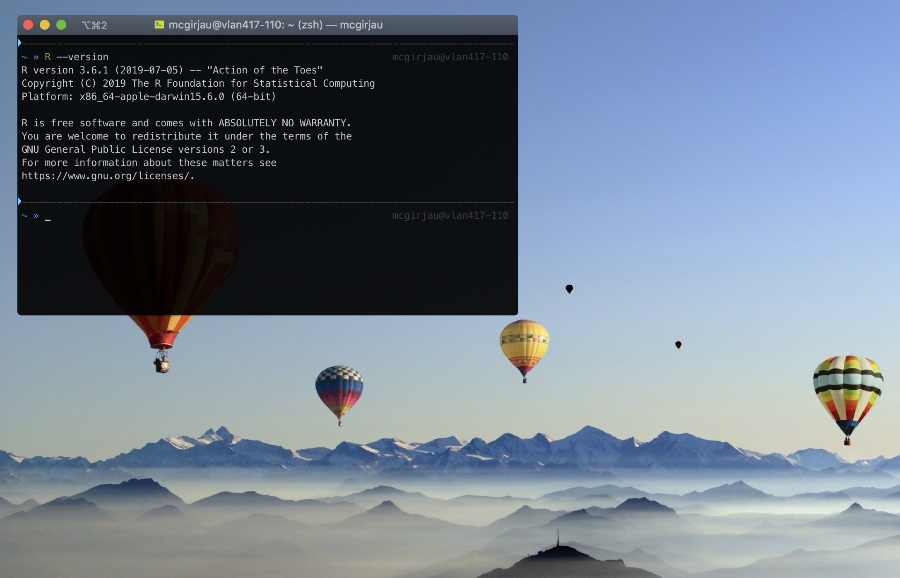

Let's download R. Go to https://cloud.r-project.org/ and click on **Download R for (Mac) OS X**.

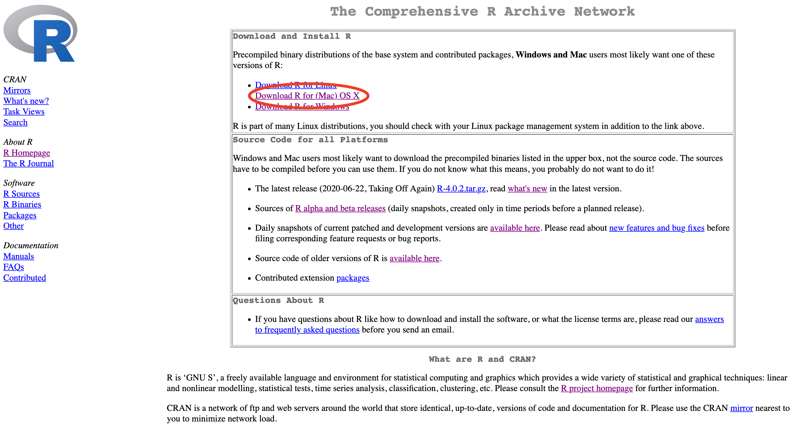

Click on the `.pkg` download of the latest R release (as of late July 2020, that is 4.0.2, nicknamed *"Taking off again"*). You can check out what's new in this version of R [here](https://stat.ethz.ch/R-manual/R-devel/doc/html/NEWS.html) - perhaps most interestingly, since version 4.0.0, R now defaults to using `stringsAsFactors = FALSE` in calls to `data.frame()` and `read.table()`.

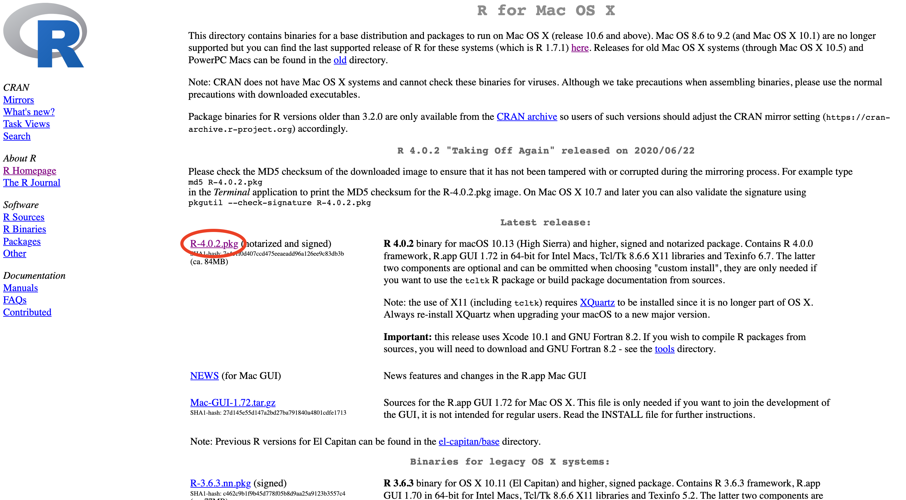
Now let's start the installation. Double click on the downloaded `.pkg` file in your browser's download pane to start the installer. If you've ever installed anything on your Mac, you should be pretty comfortable with this process. Click **Continue**.

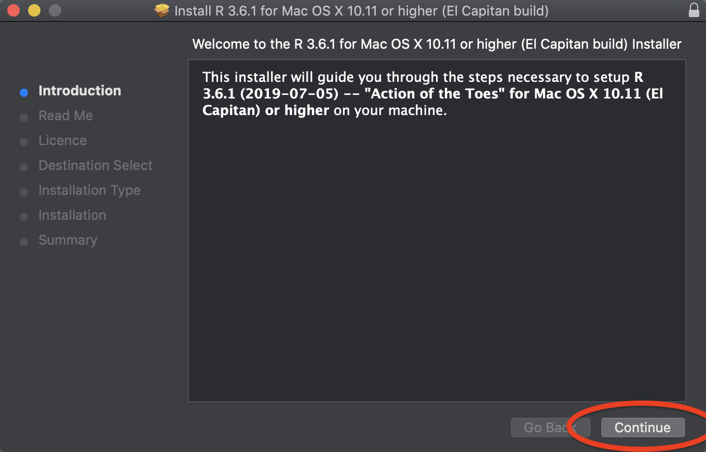

Click **Continue** again...

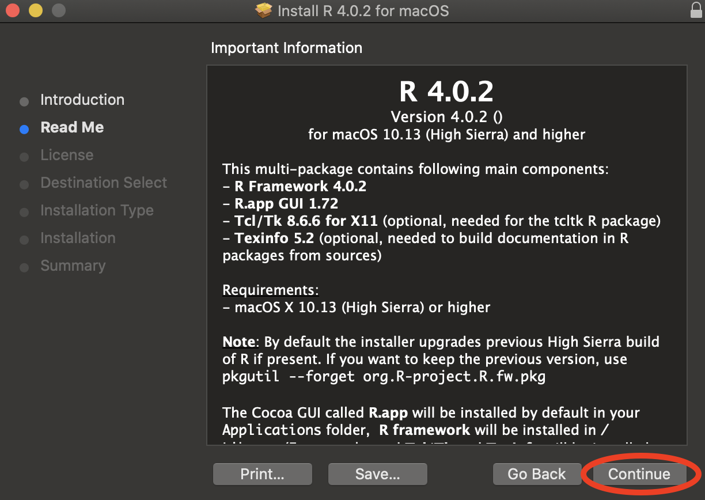

...and again one more time.

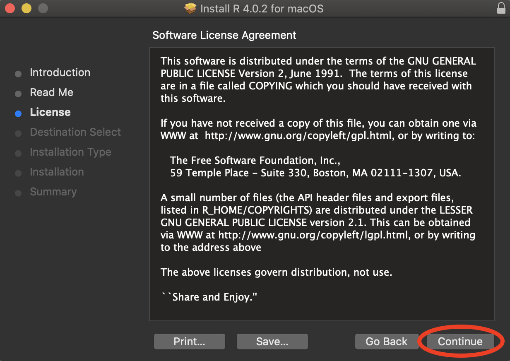

Agree to the terms of service - if you disagree, you cannot install R.

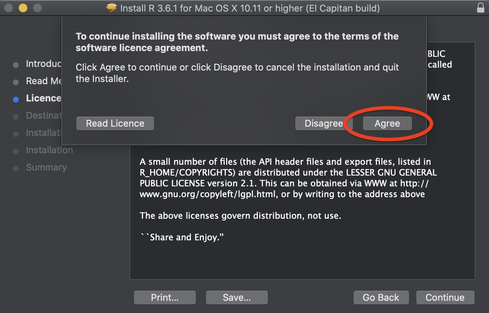

Click **Continue** one last time.

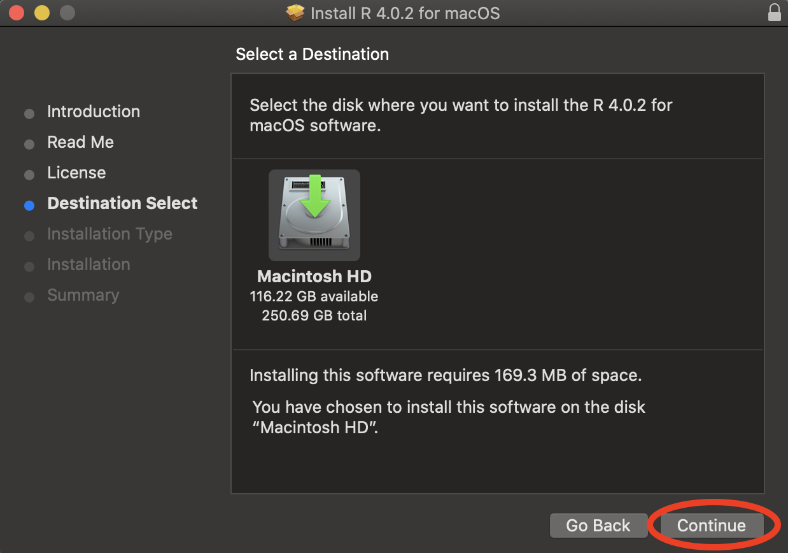

Finally, click **Install**. The installation is not big (just over 160Mb), but make sure you have sufficient disk space nonetheless.

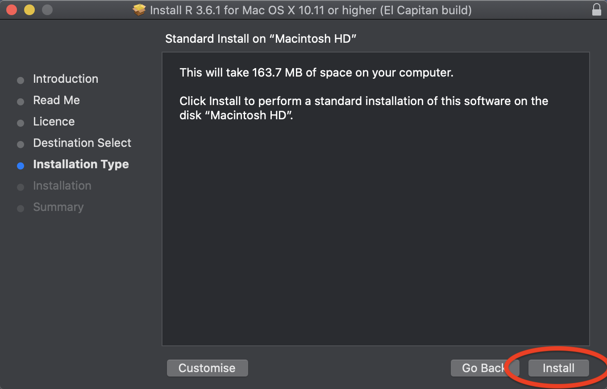

Also, make sure to give permission for the installation. Note that you cannot do this unless you have administrator rights on your machine (which you should have if you're using your own laptop).

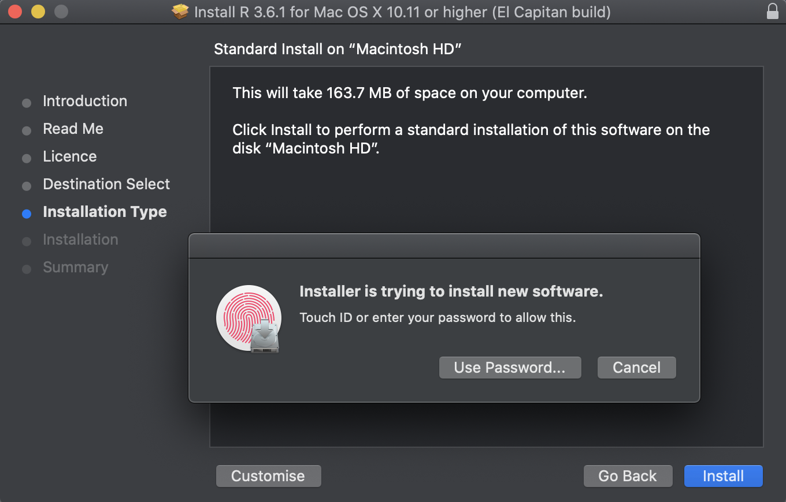

Let the installation run its course. This should be pretty quick - less than a minute.

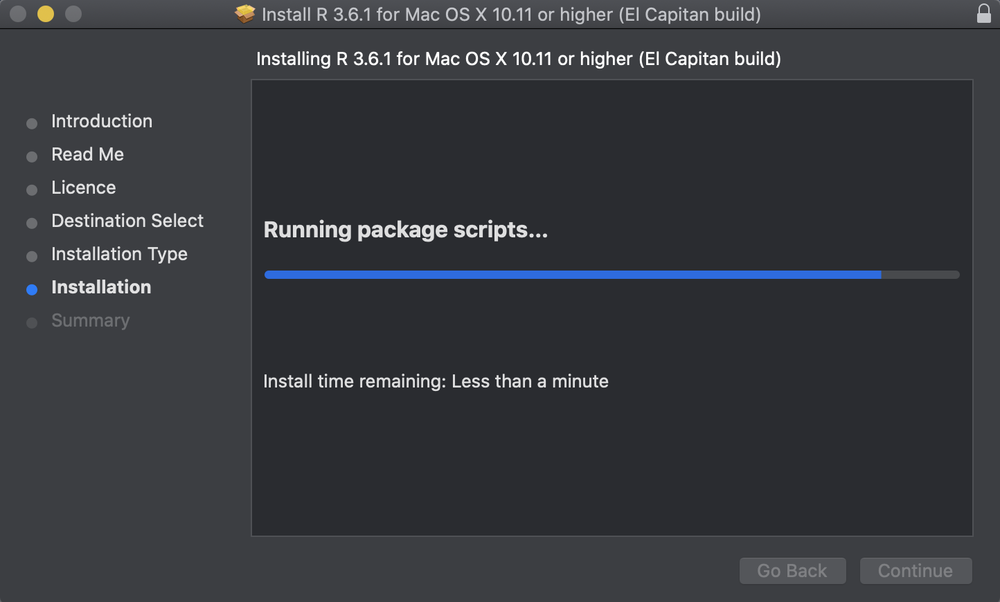

Close the installer... 

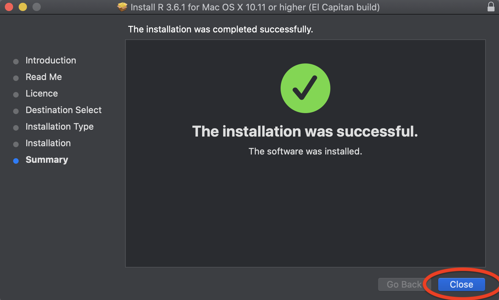
...and move the `.pkg` file to Trash.

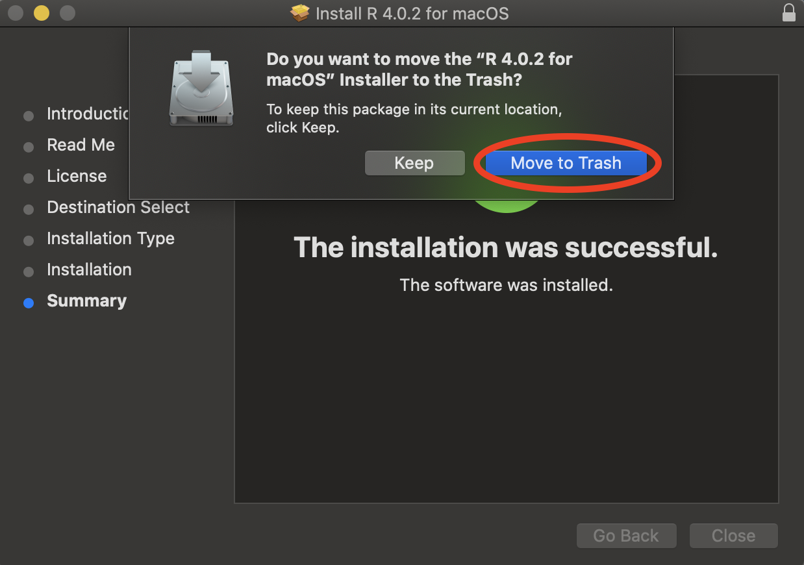

To check that everything went well, reopen the Terminal and type in the same command as before:

```{bash, eval=FALSE}
R --version
```

This time, the ``command not found`` error should be replaced by information on the R version you're running on your machine.

# Installing R (for Windows)

If you already have R installed, skip this section and go straight to installing RStudio. To check whether or not you have R, click on the *Start* menu at the bottom left of your desktop, and check whether R appears in the list of all programs. If it does, it means that R is already installed on your computer - clicking on it once will reveal which version it is. It's best to make sure you have the latest version installed - if your version is lower than 4.0.2, it might be a good idea to do a fresh reinstall of R.

Let's download R. Go to https://cloud.r-project.org/ and click on **Download R for Windows**. Note that the screenshots for the Windows installation are taken from an older version (3.6.1), but the process should still be the same.


Now under **Subdirectories**, click the **base** link.


Click the link that says **Download R 4.0.2 for Windows** to download a `.exe` file.


Now let's start the installation. Double click on the downloaded `.exe` file in your browser's download pane, or wherever you saved it to, in order to open the setup wizard. When asked whether you allow this app to make changes to your device, click **Yes**. Note that you cannot do this unless you have administrator rights on your machine (which you should have if you're using your own laptop).

You can use any language you want during installation, but this guide will be using English, so if you want to follow along it's best that you use English too. Click **Ok**.


Click **Next**.


You will be prompted to choose a location for your installation - the setup wizard usually picks a good place by default (usually in your **Program Files** directory), so you needn't modify anything here unless you specifically want your R installation in a different place. Click **Next**.


You will now be prompted for which components you'd like to install - make sure all are selected (unless you specifically desire not to install certain components), and click **Next**.


Accept defaults for startup options, unless you know what you're doing. Click **Next**.


The setup wizard will create a shortcut in your Start Menu. You can leave everything as it is, and click **Next**.


If you want to create a Desktop shortcut, or a Quick Launch shortcut, make sure to select the appropriate checkboxes. Leave the bottom two checkboxes (under "Registry entries") selected. Click **Next**.


The setup wizard will now proceed to install everything appropriately. This should be fairly quick - less than a minute.


Once the installation is complete, click **Finish** to quit the setup wizard.


R should now be installed on your machine! Just to double check, click on the *Start* menu at the bottom left of your desktop, and make sure that R appears in the list of all programs.

# Installing RStudio (for MacOS)

Now let's install RStudio - the most popular IDE (Integrated Development Environment) for the R language. If you already have RStudio installed, you can skip this section.

Go to https://rstudio.com/products/rstudio/download/, and scroll down until you see the download options. We will be downloading RStudio Desktop (Open Source License), since it is free - click the big blue **Download** button.

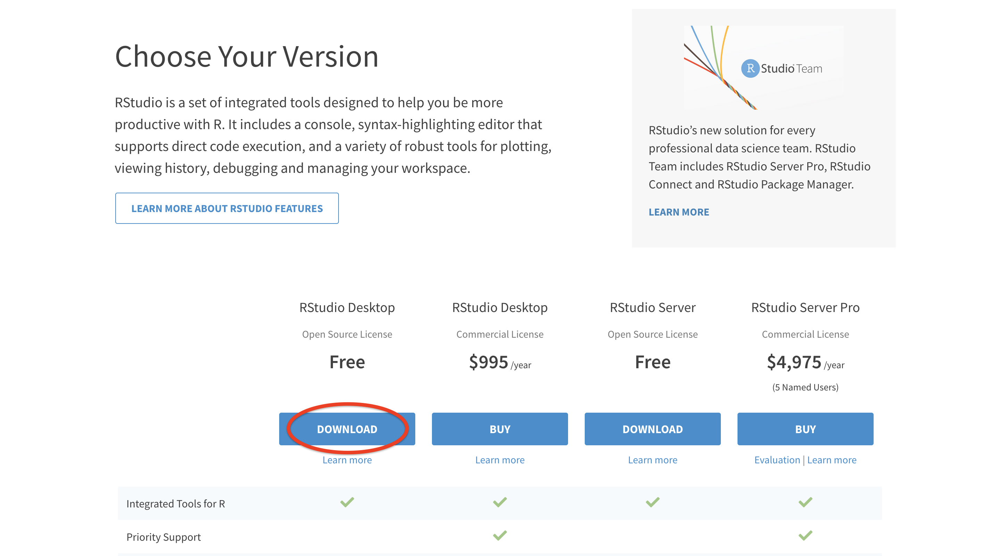

This takes us to another big blue button, for RStudio version 1.3.1056. It should automatically detect that you are using a Mac, so clicking it will download a `.dmg` file onto your machine. 

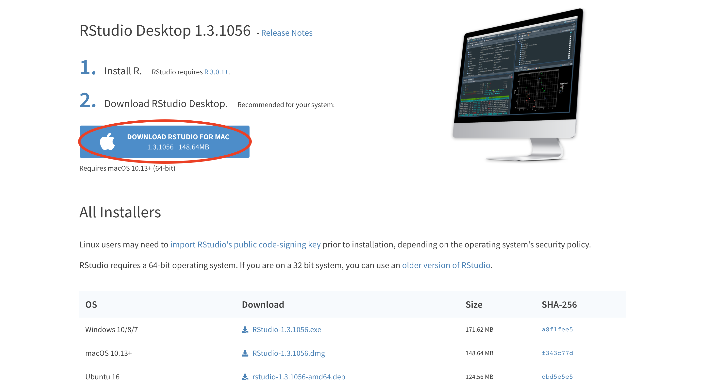

Double click on the `.dmg` file in the downloads pane, or wherever you downloaded it to, to start the installer. Again, if you've installed programs on your Mac before, this should be familiar territory. The installer will do its thing.

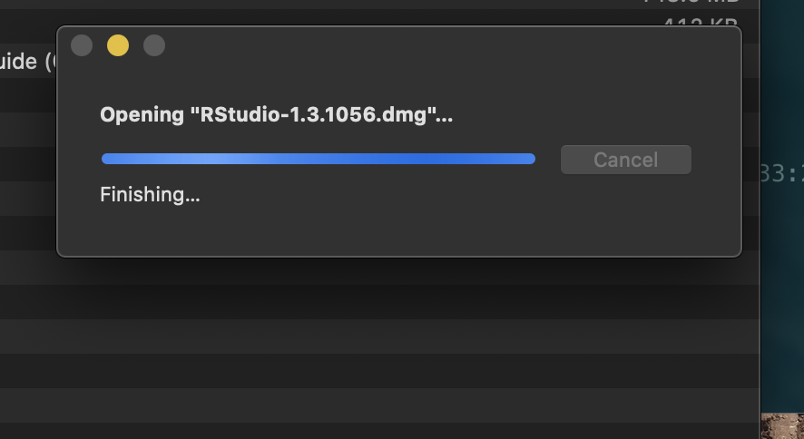

A window like the one below will appear once everything is done. Click and drag the *RStudio.app* icon into the Applications folder.

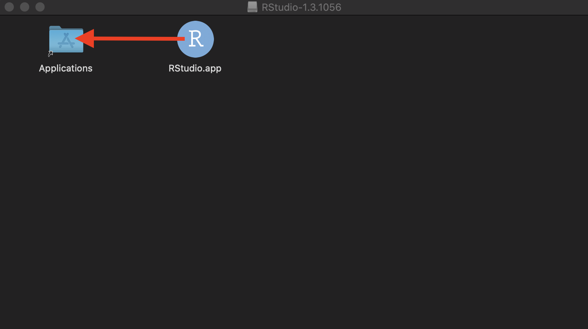

Don't forget to eject the installer at the very end - right click onto the disk icon that appeared on your Desktop during installation, and select **Eject "RStudio-1.3.1056"**.

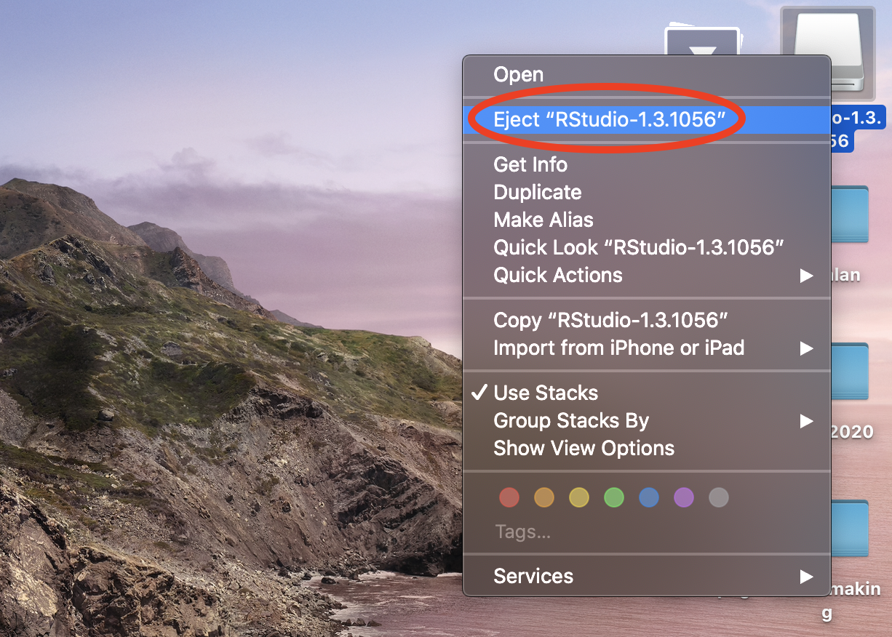

# Installing RStudio (for Windows)

Now let's install RStudio - the most popular IDE (Integrated Development Environment) for the R language. If you already have RStudio installed, you can skip this section.

Go to https://rstudio.com/products/rstudio/download/, and scroll down until you see the download options. We will be downloading RStudio Desktop (Open Source License), since it is free - click the big blue **Download** button.

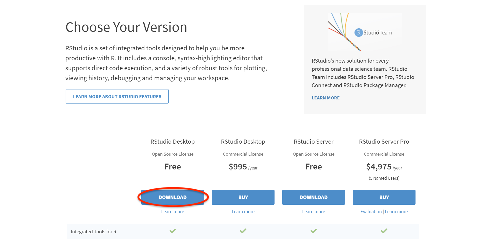

This takes us to another big blue button, for RStudio version 1.3.1056. It should automatically detect that you are using a Windows machine (despite the screenshot below being from a Mac), so clicking it will download a `.exe` file onto your machine.


Double click on the `.exe` file in the downloads pane, or wherever you downloaded it to, to start the installer. Click **Next**.

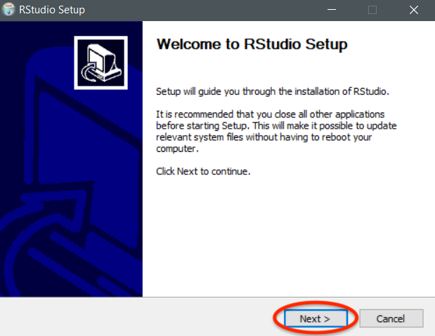

You will be prompted to choose a location for your installation - the setup wizard usually picks a good place by default (usually in your *Program Files* directory), so you needn't modify anything here unless you specifically want your RStudio installation in a different place. Also, make sure you have enough disk space available. Click **Next**.

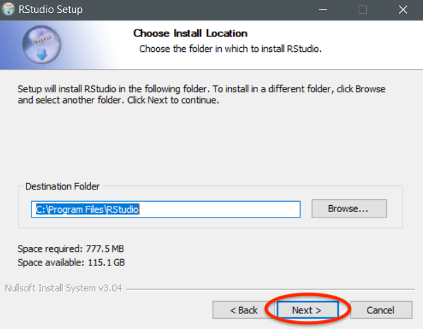

The setup wizard will create a shortcut in your Start Menu. You can leave everything as it is, and click **Next**.

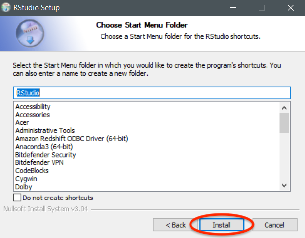

The setup wizard will now do its thing. This shouldn't take too long.

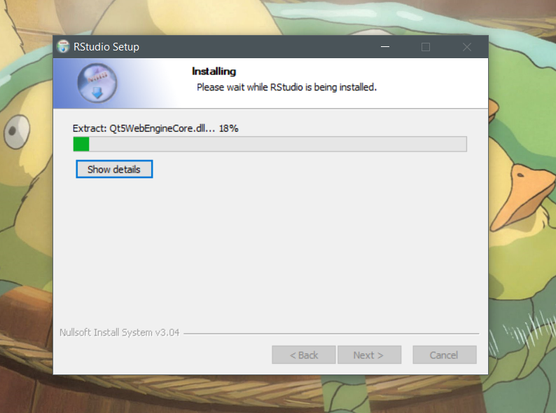

Once the installation is complete, click **Finish** to quit the setup wizard.

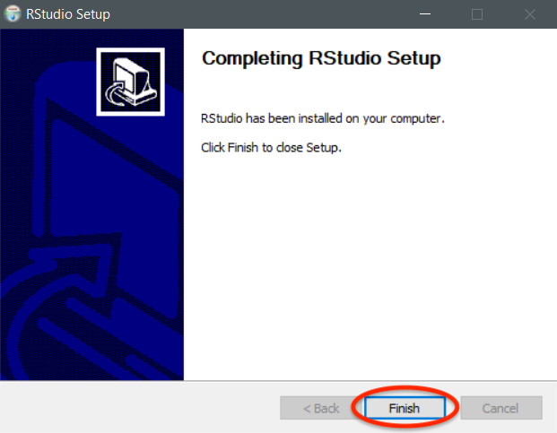

# Installing LaTeX

LaTeX is a system for typing up high-quality documents. We need LaTeX in R in order to be able to knit R Markdown documents to pdf. If we try to knit a `.Rmd` file to `.pdf` before installing LaTeX, we get the following error:

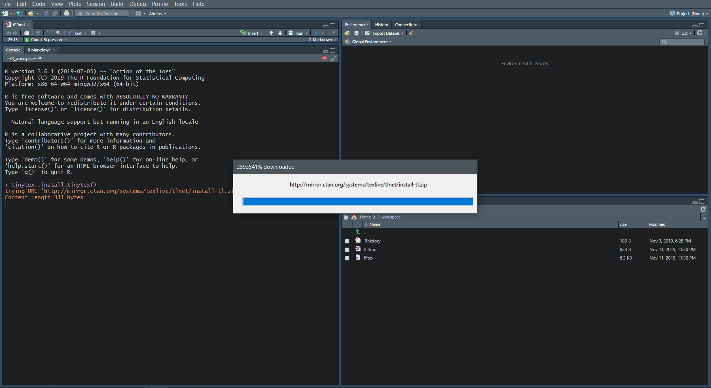

While LaTeX installations are platform-dependent, installing it for the sole purpose of use in R Markdown can be done very easily in a platform-independent way from within RStudio. Just open up RStudio, and type the following code into the console:

```{r, eval=FALSE}
install.packages("tinytex")
tinytex::install_tinytex()
```

The installer will start. You will see something like this (note that this screenshot is taken from a Windows computer, it might look a tad different on a Mac):

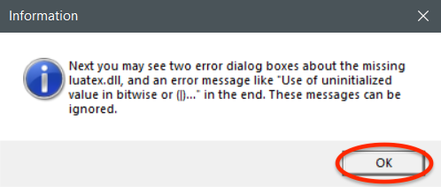

For Windows PCs only, you might see the following dialog box pop up. Just click **Ok**.

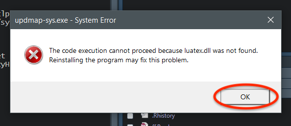

As the dialog box mentioned, you'll see two more error dialog boxes. Don't worry about them - just ignore whatever they say and click **Ok** for both.


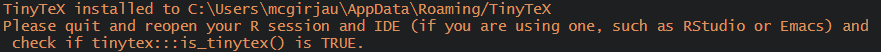

Once everything is done, you should see the prompt (i.e. the funny `>` symbol in the console after which you type commands), as well as the following message:


Now quit RStudio by pressing `Cmd + Q` on a Mac or `Alt + F4` on Windows, and then reopen it. To check whether your installation was successful, now type into the console:

```{r, eval=FALSE}
tinytex:::is_tinytex()
```

You should see the output `[1] TRUE`.

# Installing Required Packages

To use functions bundled up in a specific package, you need to load that package in your R session using the command `library(name_of_package)`. But to be able to do that, you first need to have that specific package installed on your computer - you can do this with the `install.packages("name_of_package")` command. Note that `install.packages()` requires that you surround the package name in (single or double) quotes.

There's a bunch of packages you have been using throughout the Intro Stats course, and they will be needed if you try to knit your previous homeworks to `.pdf`. They're also generally useful to have, if you plan on taking more Stats courses in the future. You can install all of them by copying and pasting the following code chunk into your console.

```{r, eval=FALSE}
packages <- c("tidyverse", # everyday data analysis
              "mosaic", # simpler functions for Intro Stats
              "kableExtra", # beautifully formatted tables
              "cowplot", # image manipulation
              "RCurl", # fetching data from the Web
              "GLMsData", # datasets
              "GGally") # extensions for plots

install.packages(packages)
```

(Note that `tidyverse` is actually a collection of packages (`ggplot2`, `dplyr`, `tidyr`, `readr`, `forcats`, `purr`, `stringr`, `tibble`), and it will install all of them in one go. They're all good packages to have - a lot of data analysis nowadays relies on the Tidyverse packages.)

Wait until R is done installing everything - this might take a while. Once everything is done, you'll see the prompt `>` reappear in the console.

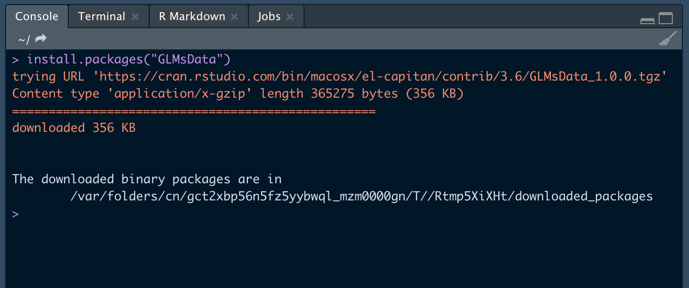

Now you can use any of those packages in your .Rmd files simply by including `library(name_of_package)` somewhere in your document (note that quotes are not necessary here, unlike with `install.packages`, but you can still use them if you'd like). It is good style to put all the `library()` statements in your preamble, like this:

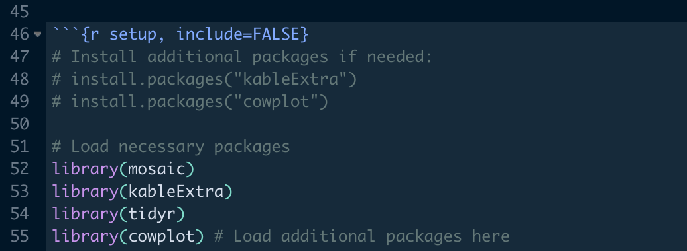

Sometimes, when you are working on a `.Rmd` file that attempts to load a package that you do not have installed, RStudio will let you know - you will see the following notification at the top of your screen. It suffices just to click **Install**, and RStudio will take care of the missing packages for you.

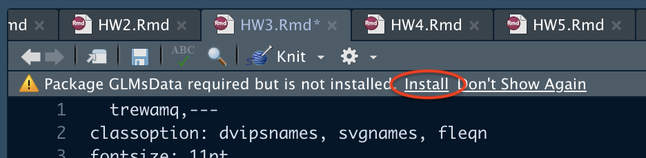

# Customizing RStudio - Theme

A first thing I suggest you do once you've downloaded RStudio is change your theme. The bright white theme that RStudio defaults to is not very great for your eyes if you spend a lot of time looking at it, so a dark theme would be better. 

To change your theme, go to **Tools** > **Global Options** in the RStudio menu. You can get there quickly by pressing `Cmd + ,` on a Mac. Unfortunately, there's no keyboard shortcut for Windows.

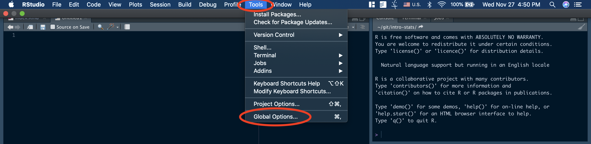

A small window will pop up. Click on **Appearance** in the menu on the left hand side of this window.

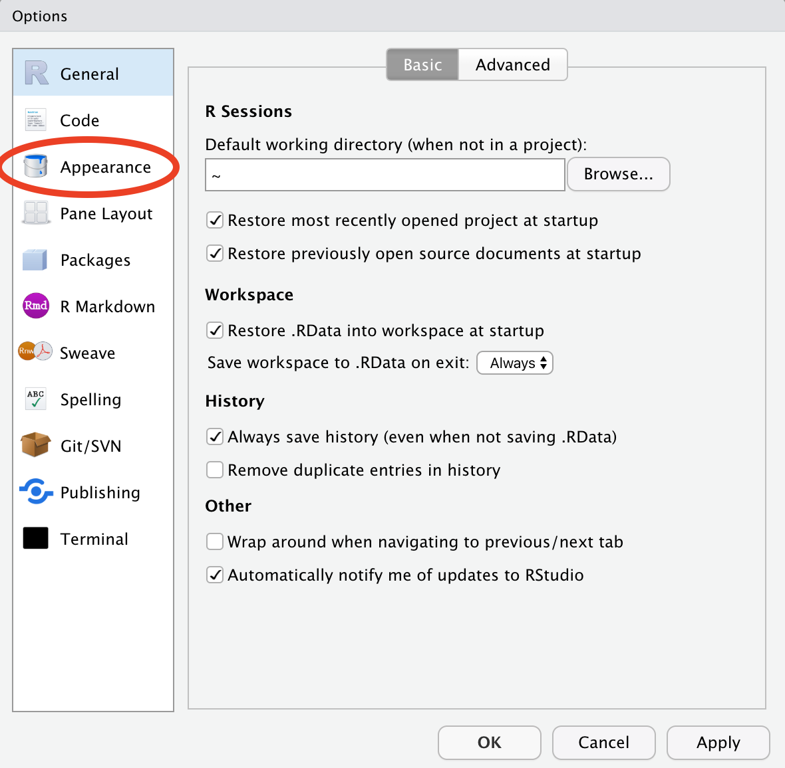

You will now have access to a bunch of options that control the way RStudio looks, e.g. font, font size etc. To change the theme, look under **Editor theme** - there, you will find a list of all the available themes. Everytime you click on one, e.g. *Dracula*, you will be shown a preview of what the code will look like on the right hand side of the window. Feel free to explore the list and pick the theme that you'd be most comfortable using. Again, I suggest you pick a dark theme since it's better for your eyes.

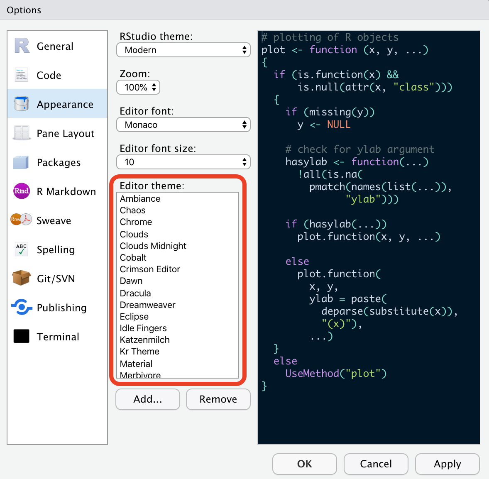

Once you have found the theme you most fancy, make sure you select it by clicking on it. For example, in the screenshot below, I have selected the theme *Twilight*. Then click **Ok**.  Changes should take effect immediately.

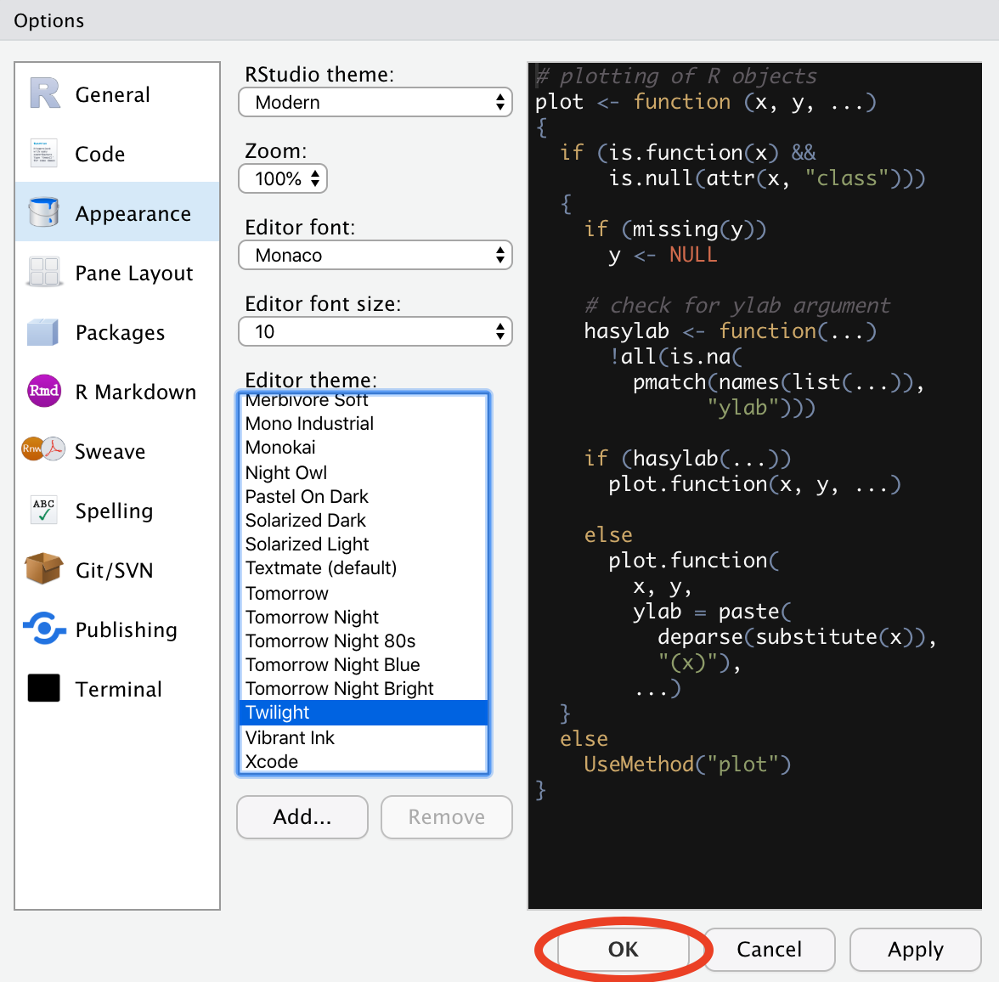

# Customizing RStudio - Layout

Another thing I suggest you do is reorganize the pane layout. The interface of RStudio is split up into 4 areas. By default, these 4 areas are: **Source**, **Console**, **Environment and History**, and **Everything else (Files, Plots, Packages, Help, Viewer etc.)**, as you can see in the screenshot below. 

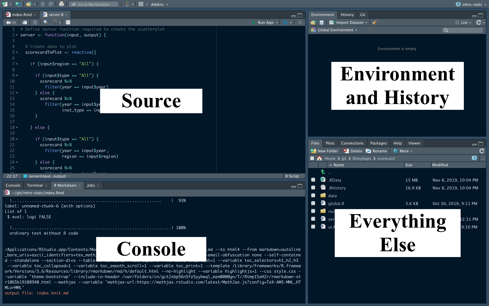

I'll be suggesting a specific rearrangement of these panes that, in my opinion, provides a better work environment than the default one. But first, let's take a look at what each component does:

1. The **Source** pane is where you write your code, e.g. when you work on a `.Rmd` file for your homework.
2. The **Console** is basically like a playground for you to experiment with pieces of code.
3. All the objects you have created (i.e. variables or functions) are listed in the **Environment**.
4. All the commands you have executed are listed in chronological order in the **History** tab.
5. If you're using Git with your project, a **Git** tab will also show up here telling you what files need to be commited (don't worry if you don't know what this means - you don't really need to).
6. You can access the files on your computer from within the **Files** tab.
7. **Plots** is where the graphs will show up if you run commands like `gf_point()` at the console.
8. **Connections** is where your connections will show up. You probably won't be using this much so don't worry about it.
9. **Packages** is where all the installed packages show up. There's a tick next to a package if that package is loaded in your current R session. Checking one of these boxes is equivalent to running `library(package-name)` into the console.
10. **Help** is where help pages show up when you run `?command_name` or `help(command_name)` in the console.
11. You can preview files in the **Viewer** pane.

The most important two panes are **Source** and **Console** - that's where most of the action happens as you work. The default RStudio layout splits the left side of the screen between these two very important panes, and, as a result, neither of them get the space they deserve. You're mostly not going to be using the right hand side of the screen much, so all that space is going to waste. This is why I think it's better to reorganize the panes as follows:

Go to **Tools** > **Global Options** in the RStudio menu (`Cmd + ,` on a Mac). 


Now click on **Pane Layout** in the left hand side menu.

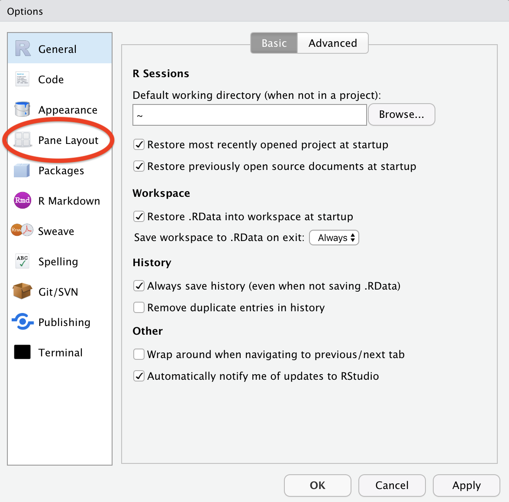

In the top left pane, select **Console** from the dropdown menu. This will move the console to the top right hand side, making more space for the **Source** pane on the left. **Environment and History** will get moved to where the console used to be (bottom left).

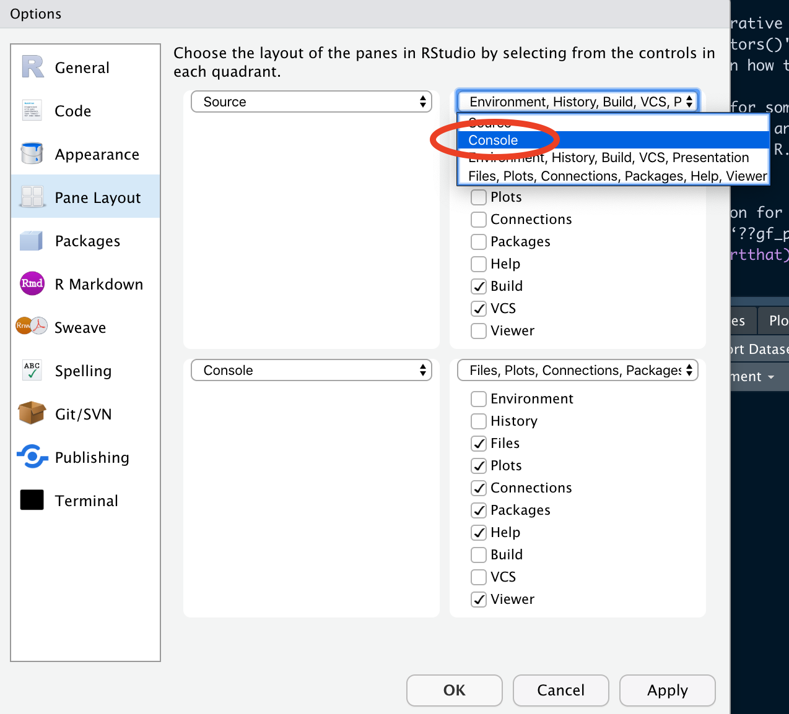

Now as a last change, check the **Environment** box in the bottom right pane. This moves the environment tab over to the left. 

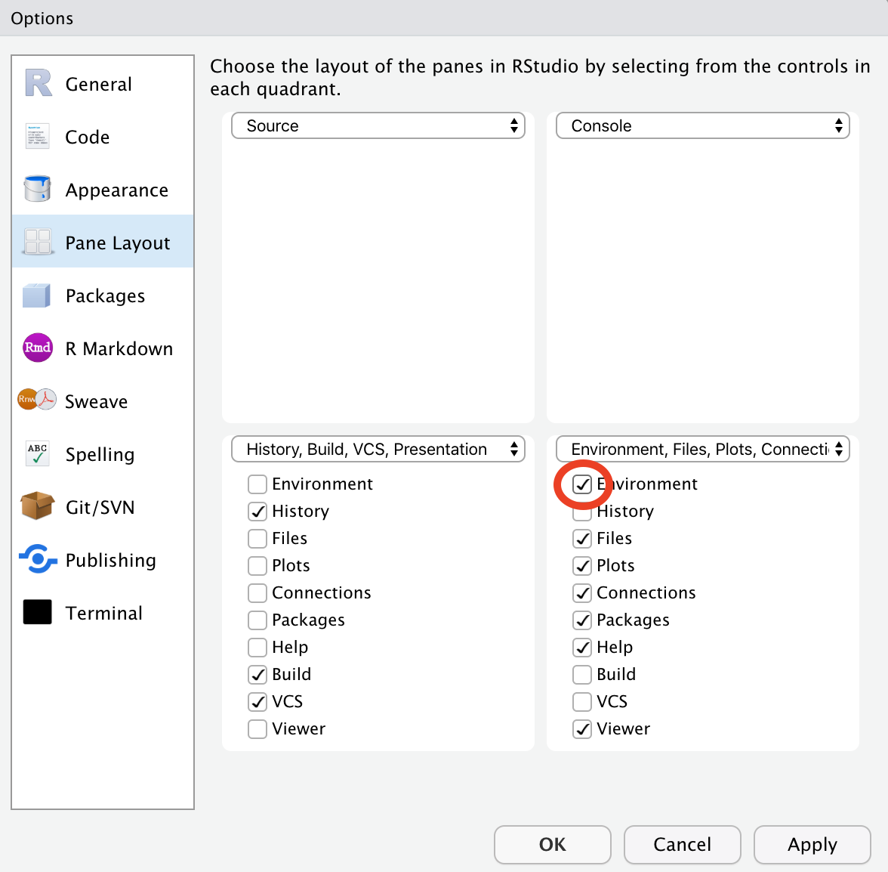

Now, click **Ok** for the changes to take effect.

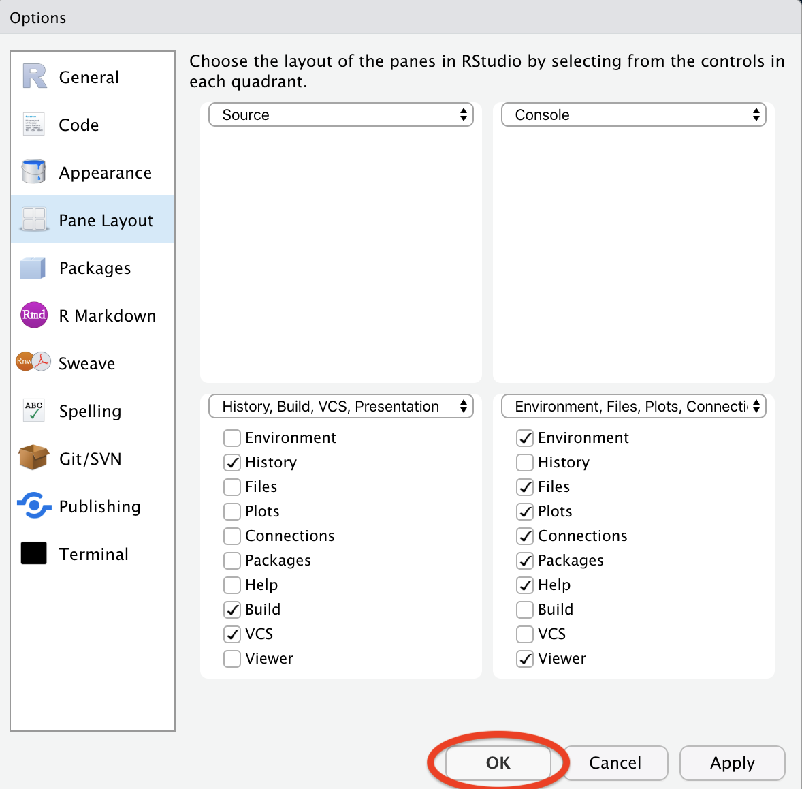

Make sure you collapse the bottom left pane by pressing the small rectangular icon on the top bar of the pane - those are the least important tabs so it's only fair we move them out of the way. 

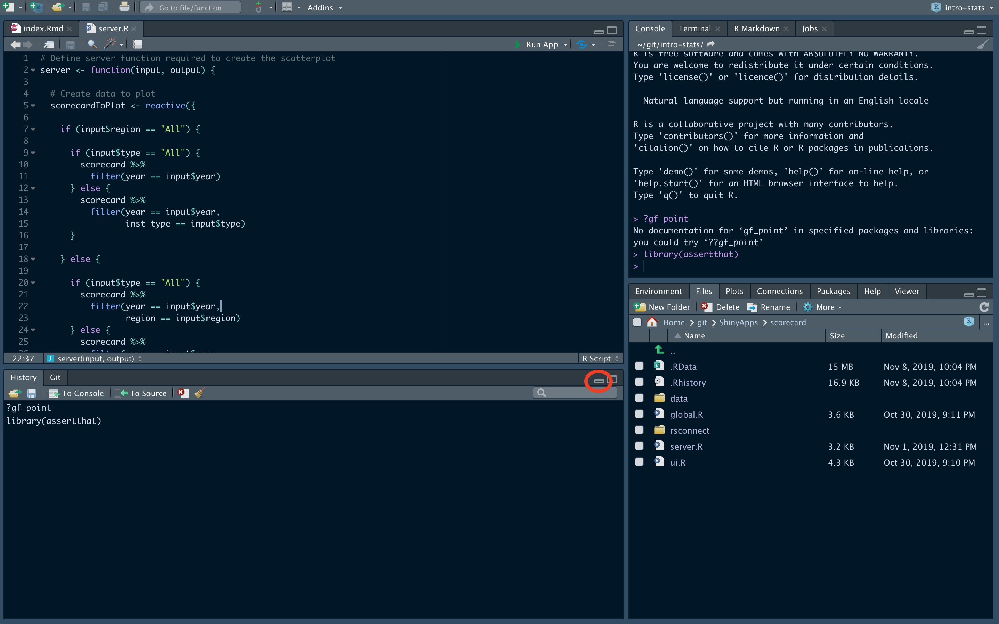

Look how much space there is for the Source pane now, and you still get access to the most important panes (Console, Environment, Files, Help etc.) on the right hand side!

# Directory Structure

It's good to be organized when saving your files - so let's briefly go over how to organize your folders.

As mentioned before, RStudio has what is called the **Files** pane, usually in the bottom right of your screen.

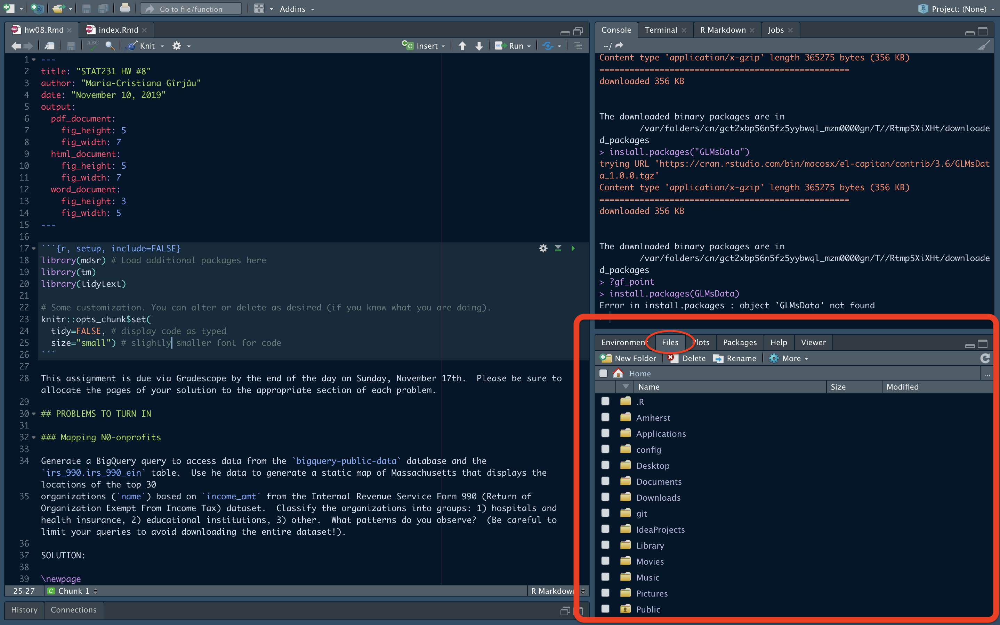

That's basically your computer (same thing as opening up a Finder window on Mac, or a File Explorer window on Windows), only now you can browse through your files from within another program. The place in your computer that will be displayed by default is what is known as your **Home directory** (directory is just a fancy name for folder) - this is usually `/Users/yourname`. To find out where your **Home** is, type the following into your console:

```{r, eval=FALSE}
getwd()
```

This actually prints your **Working directory**, not your **Home directory**, but by default (or unless you changed it manually), your working directory should be your home directory. 

So what's the difference between the two? Well, your home directory is fixed - you always start out there. In a way, everytime you turn on your computer, that's where you "spawn". If you open up the Terminal on a Mac or the Command Line on a Windows machine, that's the place you are in by default. It is, quite literally, your home. 

From your home, you can of course travel to many different places. That's the idea of a working directory. You won't always be working directly in your home - you might be working in a subfolder. So then that subfolder that you're currently working on will be your working directory. There can be many working directories (i.e. any of the folders in your computer that you decide to work in), but there can only be one home directory.

As mentioned before, it's a good idea to be organized with your files. I suggest having one different folder for every course you are taking that requires you work in R. Within the files pane, make sure you are in the home directory (you can quickly get there from anywhere else by clicking on the nice little house icon).

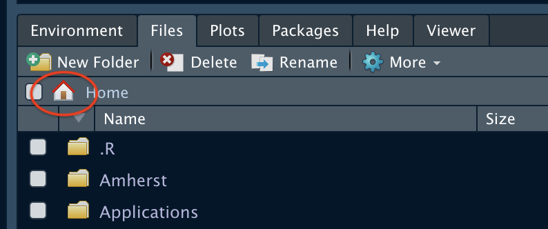

Now click on **New Folder**.

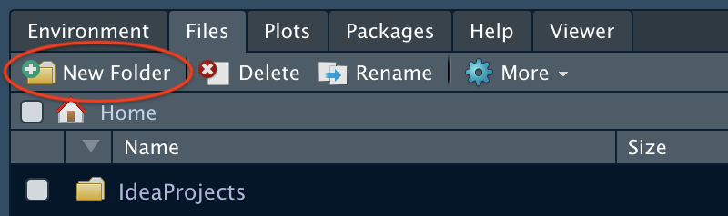

You will be prompted for a folder name - call it `STAT135` (or whatever else you wish, just make sure you know what it stands for). As a general guideline, it's good practice to not include spaces in your folder names. That makes working with them at the command line easier, but if you don't think you'll be doing any such programming later on, I guess spaces wouldn't hurt too much. Click **Ok**.

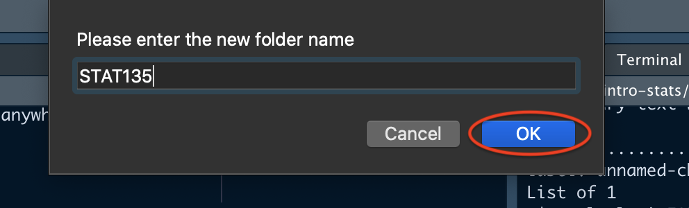

Now a folder has been created for you - you can check that it exists in the Files pane. That folder isn't only in RStudio, it actually exists now on your machine, so you can access it with Finder of File Explorer as well! We just used RStudio as a tool to create it.

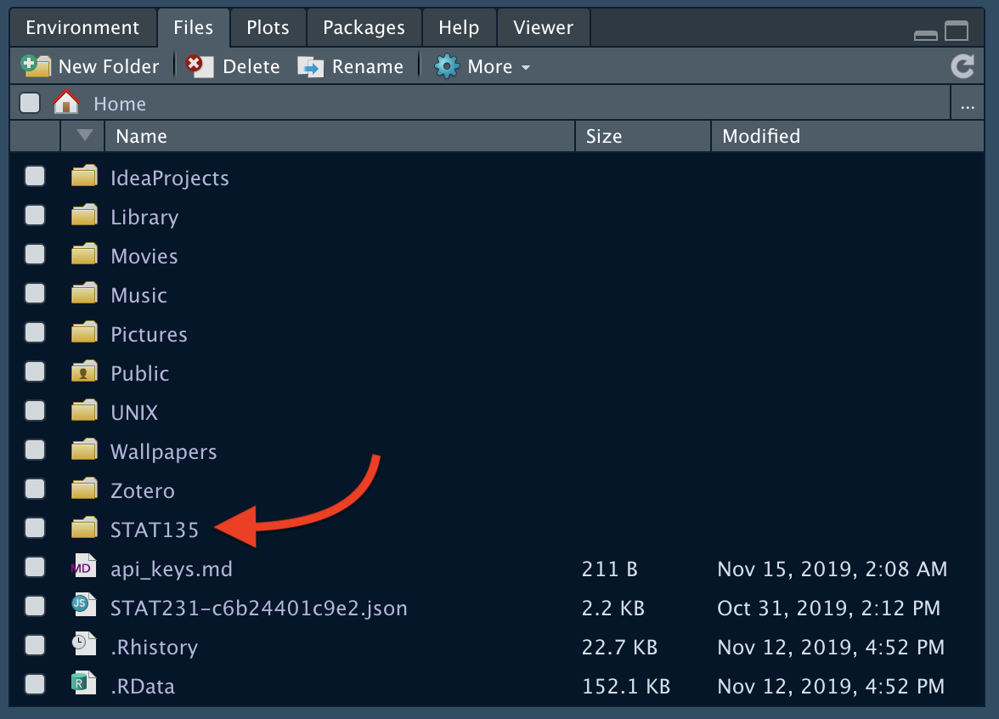

Make sure to put every class-related file inside this newly created folder. That way, you'll always know where to find something. Within the `STAT135` folder, you can go also ahead and create other subfolders if you so please. I like to have separate folders for my class notes, for the homework, and for in-class activities, but it's up to you if and how you want to organize your files.

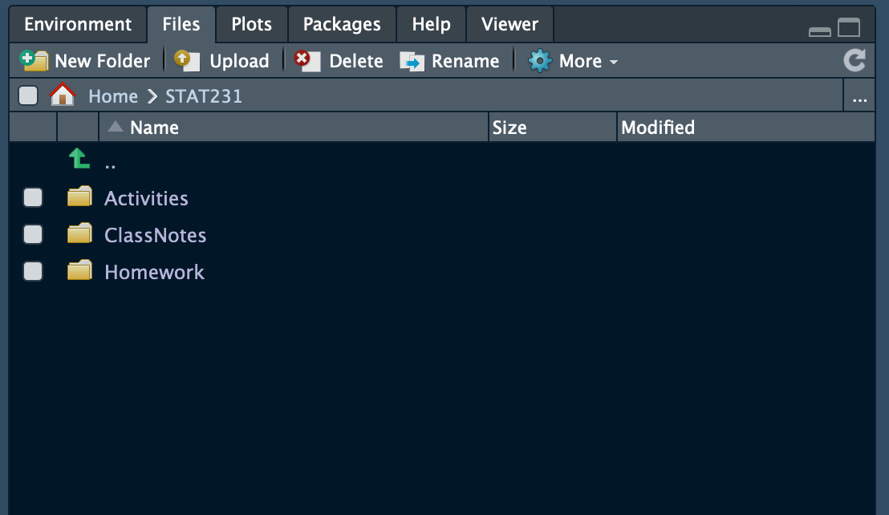

Note that RStudio always tells you the current directory you are in at the top of the Files pane. So even if you're deep into many many nested directories, you will always know where you are in relation to your home directory.

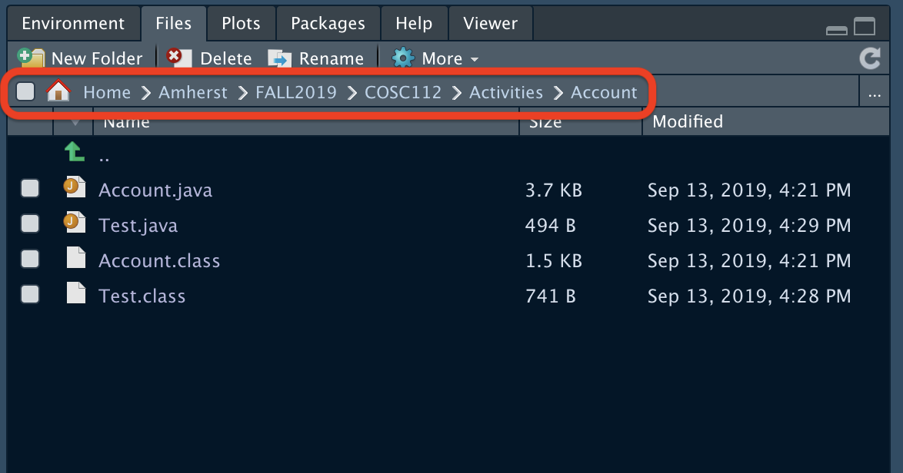

# Transferring Files from the Server

Now you should move some of the files you have on the server to your machine - whichever ones you think you might need to work with locally later on. One very straightforward way to do that is to just log on to the RStudio server (if it decides to work at that particular moment), and directly download the files. 

For Mac users, there's also two other ways, should the RStudio server not be currently available. Unfortunately, if you're a Windows user, those ways will not work for you. The reason is that the college's server is UNIX-based, as are Macs, so integration between the two is very easy. Windows is not UNIX-based, so it's more difficult to access a remote UNIX server, and while there are instructions for doing so, the probability you'll run into some sort of error is very high. If you have a Windows machine, the easiest way to get your server files locally is by using the direct download method, whenever the RStudio server is working. Otherwise, go to IT (Level 1 of Seeley Mudd) - they might be able to help you out in other ways.

## Download (MacOS and Windows)

The most straightforward way to get all your files from the server is simply by downloading them. Log into the RStudio server (if it's working at the moment), and then look at the Files tab in the bottom right corner. Check the box next to all the files and folders you want to download.

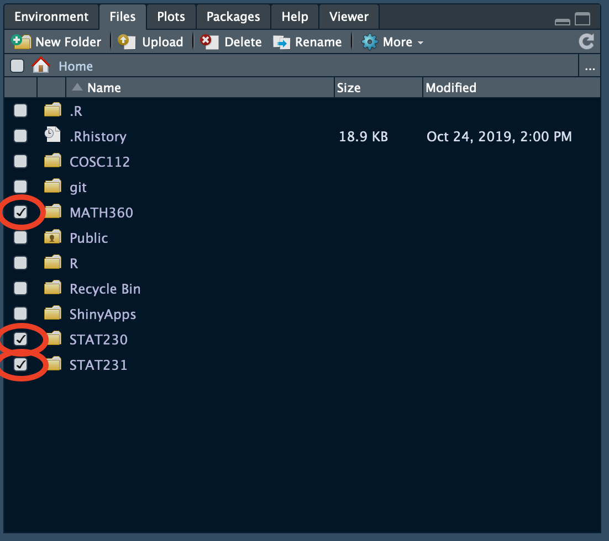

Now in the menu at the top of the pane, click **More** > **Export**.

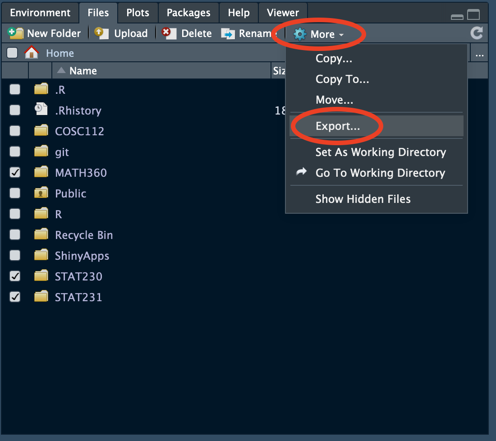

If you selected multiple files or a folder, they will be downloaded as a zipped file (`.zip`). You can name that file whatever you want, then click **Download**.


Save the file wherever you please.


You can now find it in your local *Downloads* folder, or wherever else you set your browser to download files.


Double clicking on the `.zip `file will unzip it and yield a normal folder. The files are now on your local machine, and you can move them wherever you want in your system, as you please.

## Mapping Drives (MacOS only)

Instructions taken from [the Amherst IT page](https://www.amherst.edu/offices/it/knowledge_base/academic-resources/unix_servers/unix_network_space). 

<span style="color:red">Note that this method only works on-campus while connected to the Amherst network, or off-campus with a [VPN connection to the Amherst network](https://www.amherst.edu/offices/it/services/network/vpn).</span>

Another way that works really nicely for Macs is mapping drives. Basically, you'll have all the server files mapped onto your machine at all times, as if the server was just another folder in your memory. To begin, open the Finder menu, and go to **Go** > **Connect to Server...**.


In the text box that appears, type in the address `smb://unix-mac.amherst.edu`. Then click **Connect**.


You might be prompted for your Amherst username and password. Enter those, and then a window will pop up asking you which volumes you want to mount. Select the one corresponding to your username, and click **Ok**.


Now if you open up a finder window, you'll see in the left hand side menu, under **Locations**, a link to `unix-mac.amherst.edu`. If you click there, you can access your server files locally, within that very same Finder window. You can now drag and drop the files to copy them wherever you want in a local directory, or you can just open them directly by double-clicking and proceed to work on them using your local RStudio install.


## Using the Terminal (MacOS only)

Instructions taken from [the Amherst IT page](https://www.amherst.edu/academiclife/departments/computer_science/computing/mac). 

Again, this method only works from a Mac. It might also work on Windows if you have a Linux client installed, like Cygwin. Through the Terminal, you can issue a command to copy all of your server files onto your local machine. This is probably the simplest method, if you're comfortable with the terminal, but it might take longer than the previous two methods. Also, don't worry if you don't understand the meaning of the commands below - you can simply copy and paste them in, without worrying about what they do.

Open up a fresh Terminal window. You must create a directory to hold all of your files from the server - you can't just dump them all somewhere since that'd be messy and a sure-fire way to forget where things are. First, let's ensure you're in the home directory, by using the `cd` command. Type the following into the Terminal and press `return`:

```{bash, eval=FALSE}
cd
```

Now, let's create a folder where we can put all of the server files. The `mkdir` command below creates a folder with the name *ServerFiles* into your current directory. Type it into the terminal and press `return`:

```{bash, eval=FALSE}
mkdir Server Files
```

Now change into the *ServerFiles* folder by again using the `cd` command followed by the name of the folder, and then pressing `return`:

```{bash, eval=FALSE}
cd Server Files
```

You'll see that the prompt has changed. Now type the following into the Terminal and press `return`. This command takes **every single file** you have on the server and puts it into the *ServerFiles* folder. **Make sure to replace `your-username` with your Amherst username, e.g. jsmith22!**

```{bash, eval=FALSE}
scp -r 'your-username@romulus.amherst.edu:*' .
```

You'll be asked for your Amherst account password. Enter that, and wait - you'll see a lot of output as the server dumps every file you have into the *ServerFiles* folder. This might take a while, depending on how much stuff you have on the server, so feel free to go make some tea or buy a drink. If it's taking waaaay too long, you can terminate the process by pressing `Ctrl + C`.

If you know you only want to download one specific folder, you can instead use the following command, which is much faster since it doesn't copy every single file on the server:

```{bash, eval=FALSE}
scp -r 'your-username@romulus.amherst.edu:directory-name' .
```

All your server files will now be in the *ServerFiles* folder, which in turn is in the home directory, and you can move them around in your computer as you please.

# Using Git with RStudio

If you're reading this section, I'm assuming you know what Git and GitHub are, and how to use them from the Terminal/Git bash. If you don't know what these tools are, don't worry - they're specialized version control tools and you probably don't need any knowledge of them in an Intro Stats class. This section is for those that specifically already use Git but don't know how to integrate it with RStudio.

First, you must generate an SSH RSA key within your local RStudio installation. Go to **Tools** > **Global Options** in the RStudio menu (`Cmd + ,` on a Mac).


In the left hand side menu, click on **Git/SVN**.


Make sure the box at the top (the one saying "Enable version control interface for RStudio projects") is checked, and then click on **Create RSA Key...** under the "SSH RSA Key" section.


I recommend not using a passphrase since that means RStudio will ask you for said passphrase everytime you commit something (which is quite inconvenient). There's no need for such security measures unless you're working on a public computer (which I assume you are not). Click **Create**.


You'll see some funny-looking text. Click **Close**.


This will take you back to the Global Options window. Now click on **View Public Key**.


This will show you the SSH RSA key. Press `Cmd + C` on a Mac or `Ctrl + C` on Windows to copy the key. Then click **Close**.


You'll again be taken back to the main window. Click **Ok** to close it.


Now you need to register this key within GitHub. Log into your account (I won't show you how to do that - I assume you know how), and go to **Settings**.


In the left hand side menu, click on **SSH and GPG keys**.


Now click the big green button that says **New SSH Key**.


This will take you to a page where you can register your SSH key. Give it a title, such as "R Studio Local", so you remember what the key is for, and then paste the key into the large text area provided (`Cmd + V` on Mac, `Ctrl + V` on Windows). Then click on **Add SSH key** at the bottom.


You will be asked to confirm your password.


Now you should be ready to use RStudio with GitHub. Go to one of your repositories that you'd like to work on locally, and click on the green button that says **Clone or download**, and then click on **Use SSH**.


Then click the icon to the side of the SSH key to copy it.


Now go back to RStudio. In the top menu, go to **File** > **New Project...**. 


Choose **Version Control**.


Choose **Git**.


Now paste the key you copied from GitHub into the field that says "Repository URL" (`Cmd + V` on Mac, `Ctrl + V` on Windows). The Project directory name should get filled in automatically with the name of your repo - if not, you can fill that in manually. Choose whatever directory you would like to clone the repo in, and click **Create Project**.


Now everytime you work on a project with Git, you will see a **Git** tab appear in RStudio. If you followed the pane layout guide above, then your Git tab should appear in the bottom left corner. Otherwise, just look around for it - you'll spot it pretty easily. Note that you have to be within a version control project for the Git tab to appear. When you edit files as you work, you can click on the Git tab to see what's changed. Files marked with a blue M have been modified, files marked with a yellow question mark have been newly added, files marked with a red D have been deleted etc.


Check all the boxed by the files you want to add/commit.


Click **Commit**.


This will take you to a separate screen. You can write your commit message in the dedicated box at the top right of the screen, and then click **Commit**.


A Git dialog box will appear. Once everything is done, click **Close**.


Now push the changes to GitHub by clicking **Push** in the top right corner. 


Another Git dialog box will appear. Wait until everything is done, and click **Close**.


That's it! Now you should see the changes you just pushed in the GitHub repo. Follow the same workflow for every Git project you have in RStudio, and remember to pull and push often, and write descriptive commit messages!

<!-- Removing trailing whitespace caused by toc_float -->

<div class="tocify-extend-page" data-unique="tocify-extend-page" style="height: 0;"></div>
