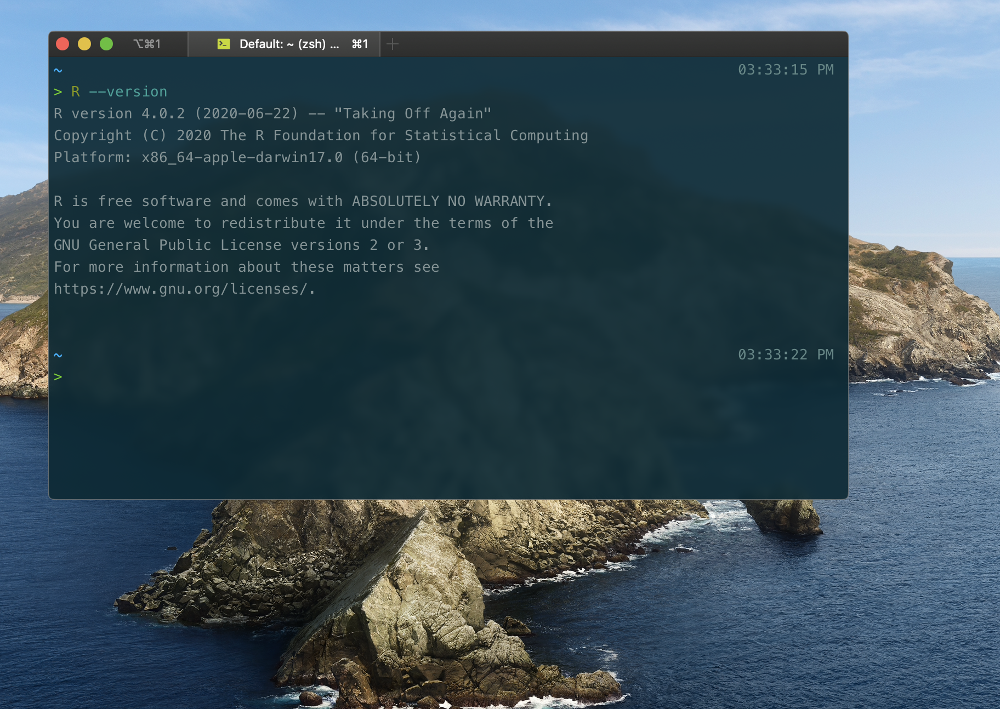
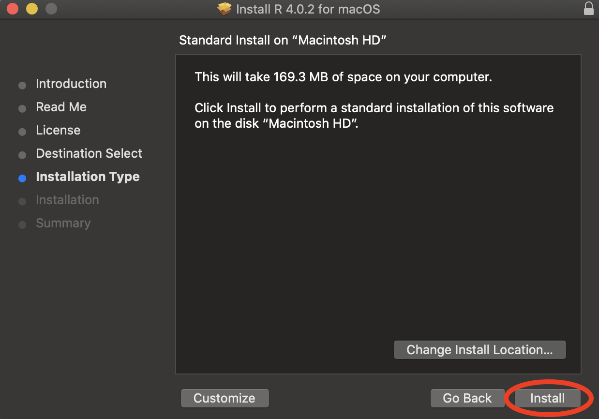
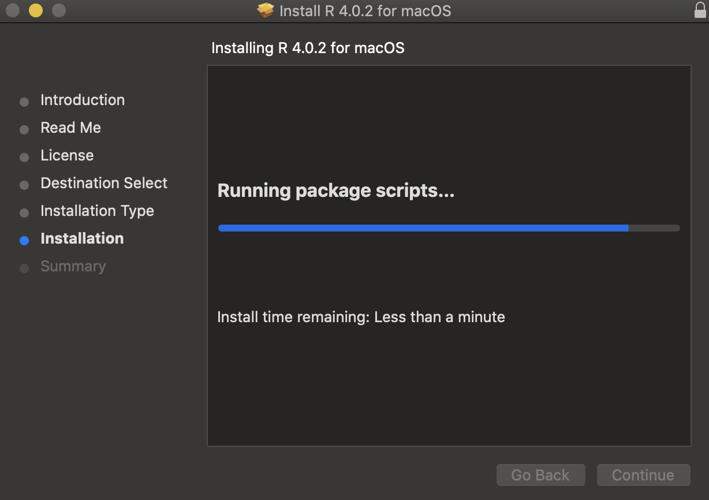
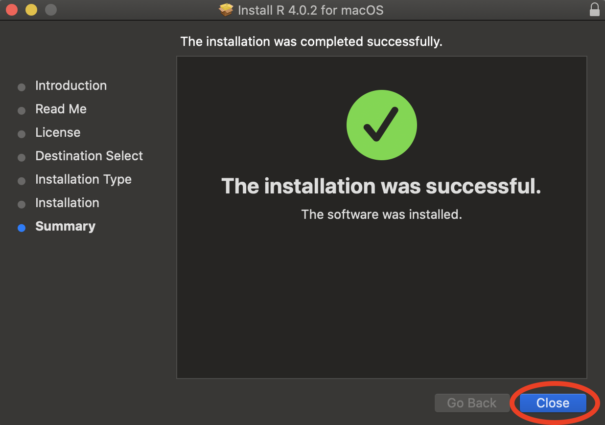
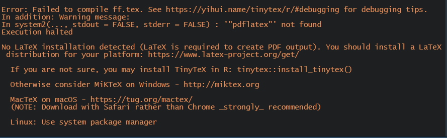

```{r setup, include=FALSE}
knitr::opts_chunk$set(echo = TRUE)
```

This is a guide to installing R and RStudio locally, on your own machine. Instructions for both Mac and Windows machines are included, as well as plenty of screenshots to make the process easy to follow. Instructions for Linux distros are not provided, but presumably if you use Linux you're knowledgeable enough about computers to be able to figure out stuff on your own.

<strong style="color:red">A word of warning:</strong> The Amherst RStudio server uses R version 3.5.2, but the one we will be installing in this guide is version 3.6.1. It just so happens that R changed the way it implements randomization algorithms in version 3.6, so functions involving random numbers (e.g. ``sample()``, ``shuffle()``, or ``rnorm()`` ) will yield different results when run locally than when run on the server (even with the same argument to ``set.seed()``). Be mindful of this if your homework includes working with random numbers, and let the professor know if you think something that's technically correct has been marked as wrong by the graders - answers are bound to differ between students working on the server and those working locally, and both should be accepted.

# macOS

## Installing R

If you already have R installed, skip this section and go straight to installing RStudio. To check whether you have R, open the Terminal and type:

```{bash, eval=FALSE}
R --version
```

If you get a ``command not found`` error, that means you don't have R installed and you can proceed with the steps below. If R is already on your machine, it's good to make sure you have the latest version installed - if your version is lower than 3.6.1, it might be a good idea to do a fresh reinstall of R.



Let's download R. Go to https://cloud.r-project.org/ and click on *Download R for (Mac) OS X*.


Click on the .pkg download of the latest R release (as of November 2019, that is 3.6.1, nicknamed "Action of the Toes" as a reference to [this Peanuts comic](https://www.gocomics.com/peanuts/1971/03/22)).

Now let's start the installation. Double click on the downloaded .pkg file in your browser's Download pane to start the installer.


If you've ever installed anything on your Mac, you should be pretty comfortable with this process.

Click *Continue*.


Click *Continue* again...


... and again one more time.


Agree to the terms of service - if you disagree, you cannot install R.


Finally, click *Install*. The installation is not big (just over 160Mb), but make sure you have sufficient disk space nonetheless.



Make sure to give permission for the installation. Note that you cannot do this unless you have administrator rights on your machine (which you should have if you're using your own laptop).


Let the installation run its course. This should be pretty quick - less than a minute.



Close the installer. 



To check that everything went well, reopen the terminal and type in the same command as before:

```{bash, eval=FALSE}
R --version
```

This time, the ``command not found`` error should be replaced by information on the R version you're running on your machine.

## Installing RStudio

Now let's install RStudio - the most popular IDE (Integrated Development Environment) for the R language. If you already have RStudio installed, you can skip this section.

Go to https://rstudio.com/products/rstudio/download/, and scroll down until you see the download options. We will be downloading RStudio Desktop (Open Source License), since it is free - click the big blue *Download* button.


This takes us to a list of downloads for different platforms - choose the one that says *RStudio 1.2.5019 - macOS 10.12+ (64-bit)*. This will download a .dmg file onto your machine. 


Double click on the .dmg file in the downloads pane, or wherever you downloaded it to, to start the installer. Again, if you've installed programs on your Mac before, this should be familiar territory. The installer will do its thing.


A window like the one below will appear once everything is done. Click and drag the *RStudio.app* icon into the Applications folder.


Don't forget to eject the installer at the very end - right click onto the disk icon that appeared on your Desktop during installation, and select *Eject "RStudio-1.2.5019"*.


# Windows

## Installing R

If you already have R installed, skip this section and go straight to installing RStudio. To check whether you have R, click on the *Start* menu at the bottom left of your desktop, and check whether R appears in the list of all programs. If it does, it means that R is already installed on your computer - clicking on it once will reveal which version it is. It's good to make sure you have the latest version installed - if your version is lower than 3.6.1, it might be a good idea to do a fresh reinstall of R.

Let's download R. Go to https://cloud.r-project.org/ and click on *Download R for Windows*.


Now under *Subdirectories*, click the *base* link.


Click the link that says *Download R 3.6.1 for Windows* to download a .exe file.


Now let's start the installation. Double click on the downloaded .exe file in your browser's Download pane, or wherever you saved it to, to open the setup wizard. When asked whether you allow this app to make changes to your device, click *Yes*. Note that you cannot do this unless you have administrator rights on your machine (which you should have if you're using your own laptop).

<!--  -->

You can use any language you want during installation, but this guide will be using English, so if you want to follow along it's best that you use English too.


Click *Next*.


You will be prompted to choose a location for your installation - the setup wizard usually picks a good place by default (usually in your *Program Files* directory), so you needn't modify anything here unless you specifically want your R installation in a different place. Click *Next*.


You will now be prompted for which components you'd like to install - make sure all are selected (unless you specifically desire not to install certain components), and click *Next*.


Accept defaults for startup options, unless you know what you're doing. Click *Next*.


The setup wizard will create a shortcut in your Start Menu. You can leave everything as it is, and click *Next*.


If you want to create a Desktop shortcut, or a Quick Launch shortcut, make sure to select the appropriate checkboxes. Leave the bottom two checkboxes (under "Registry entries") selected. Click *Next*.


The setup wizard will now proceed to install everything appropriately. This should be fairly quick - less than a minute.


Once the installation is complete, click *Finish* to quit the setup wizard.


R should now be installed on your machine! Just to double check, click on the *Start* menu at the bottom left of your desktop, and make sure that R appears in the list of all programs.

## Installing RStudio

Now let's install RStudio - the most popular IDE (Integrated Development Environment) for the R language. If you already have RStudio installed, you can skip this section.

Go to https://rstudio.com/products/rstudio/download/, and scroll down until you see the download options. We will be downloading RStudio Desktop (Open Source License), since it is free - click the big blue *Download* button.


This takes us to a list of downloads for different platforms - choose the one that says *RStudio 1.2.5019 - Windows 10/8/7 (64-bit)*. This will download a .exe file onto your machine. 


Double click on the .exe file in the downloads pane, or wherever you downloaded it to, to start the installer. Click *Next*.


You will be prompted to choose a location for your installation - the setup wizard usually picks a good place by default (usually in your *Program Files* directory), so you needn't modify anything here unless you specifically want your RStudio installation in a different place. Also, make sure you have enough disk space available - RStudio requires a significant 777 Mb. Click *Next*.


The setup wizard will create a shortcut in your Start Menu. You can leave everything as it is, and click *Next*.


The setup wizard will now do its thing. This shouldn't take too long.


Once the installation is complete, click *Finish* to quit the setup wizard.



# Installing LaTeX

LaTeX is a system for typing up high-quality documents. We need LaTeX in R in order to be able to knit R Markdown documents to pdf. If we try to knit a .Rmd file to .pdf before installing LaTeX, we get the following error:


While LaTeX installations are platform-dependent, installing it for the sole purpose of use in R Markdown can be done very easily in a platform-independent way from within RStudio. Just open up RStudio, and type the following code into the console:

```{r, eval=FALSE}
install.packages("tinytex")
tinytex::install_tinytex()
```

The installer will start. You will see something like this (note that this screenshot is taken from a Windows computer, it might look a tad different on a Mac):


For Windows PCs only, you might see the following dialog box pop up. Just click *Ok*.


As the dialog box mentioned, you'll see two more error dialog boxes. Don't worry about them - just ignore whatever they say and click *Ok* for both.


Once everything is done, you should see the prompt (i.e. the funny ``>`` symbol in the console after which you type commands), as well as the following message:


Now quit RStudio by pressing ``Cmd + Q`` on a Mac or ``Alt + F4`` on Windows, and then reopen it. To check whether your installation was successful, now type into the console:

```{r, eval=FALSE}
tinytex:::is_tinytex()
```

You should see the output ``[1] TRUE``.

# Setting Up Your Workspace

## Directories

It's good to be organized when saving your files - so let's briefly go over the folder hierarchy.

RStudio has what is called the *Files* pane, usually in the bottom right of your screen. My setup probably looks a little different than yours, since I moved some stuff around and also have a theme applied, but the *Files* pane should be in the same place.


That's basically your computer - same thing as opening up a Finder window on Mac, or a File Explorer window on Windows, only now you can browse through your files from within another program. The place in your computer that will be displayed by default is what is known as your *Home directory* (directory is just a fancy name for folder) - this is usually ``/Users/yourname``. To find out where your *Home* is, type the following into your console:

```{r, eval=FALSE}
getwd()
```

This actually prints your *Working directory*, not your *Home directory*, but by default (or unless you changed it manually), your working directory should be your home directory. 

So what's the difference between the two? Well, your home directory is fixed - you always start out there. In a way, everytime you turn on your computer, that's where you "spawn". If you open up the terminal on a Mac or the Command Line on a Windows machine, that's the place you are in by default. It is, quite literally, your home. 

From your home, you can of course travel to many different places. That's the idea of a working directory. You won't always be working directly in your home - you might be working in a subfolder. So then that subfolder that you're currently working on will be your working directory. There can be many working directories (any of the folders in your computer that you decide to work in), but there can only be one home directory.

As mentioned before, it's a good idea to be organized with your files. I suggest having one different folder for every course you are taking that requires you work in R. Within the files pane, make sure you are in the home directory (you can quickly get there from anywhere else by clicking on the nice little house icon).


Now click on *New Folder*.


You will be prompted for a folder name - call it ``STAT135`` (or whatever else you wish, just make sure you know what it stands for). As a general guideline, it's good practice to not include spaces in your folder names. That makes working with them at the command line easier, but if you don't think you'll be doing any sort of programming later on, I guess spaces wouldn't hurt too much. Click *Ok*.


Now a folder has been created for you - you can check that it exists in the *Files* pane. That folder isn't only in RStudio, it actually exists now on your machine, so you can access it with Finder of File Explorer as well! We just used RStudio as a tool to create it. 


Every class-related file that you get, make sure to put inside this newly created folder. That way, you'll always know where to find something. Within the STAT135 folder, you can go ahead and create other subfolders if you so please. I like to have separate folders for my class notes, for the homework, and for in-class activities, but it's up to you if and how you want to organize your files.


Note that RStudio always tells you the current directory you are in at the top of the *Files* pane. So even if you're deep into many many nested directories, you will always know where you are in relation to your home directory.


## Transferring Files from the RStudio Server

## Packages

To use functions bundled up in a specific package, you need to load that package in your R session using the command ``library(name_of_package)``. But to be able to do that, you need to have that specific package installed on your computer - you can do this with the ``install.packages("name_of_package")`` command. Note that ``install.packages()`` requires that you surround the package name in (single or double) quotes.

There's a bunch of packages you have been using throughout the Intro Stats course, and they will be needed if you try to knit your previous homeworks to .pdf. They're also generally useful to have, if you plan on taking more Stats courses in the future. You can install all of them by copying and pasting the following code chunk into your console.

```{r, eval=FALSE}
packages <- c("tidyverse", # everyday data analysis
              "mosaic", # simpler functions for Intro Stats
              "kableExtra", # beautifully formatted tables
              "cowplot", # image manipulation
              "RCurl", # fetching data from the Web
              "GLMsData", # datasets
              "GGally") # extensions for plots

install.packages(packages)
```

(Note that ``tidyverse`` is actually a collection of packages (``ggplot2, dplyr, tidyr, readr, forcats, purr, stringr, tibble``), and it will install all of them in one go. They're all good packages to have installed - a lot of data analysis nowadays relies on the Tidyverse packages.)

Wait until R is done installing everything - this might take a while. Once everything is done, you'll see the prompt ``>`` reappear in the console.


Now you can use any of those packages in your .Rmd files simply by including a ``library(name_of_package)`` somewhere in your document (note that quotes are not necessary here, unlike with ``install.packages``, but you can still use them if you'd like). It is good styleto put all the ``library()`` statements in your preamble, like this:


Sometimes, when you are working on an .Rmd file that attempts to load a package that you do not have installed, RStudio will let you know - you will see the following notification at the top of your screen. It suffices just to click install, and RStudio will take care of the missing packages for you.


# Optional

## Customizing RStudio

## Using GitHub with RStudio
