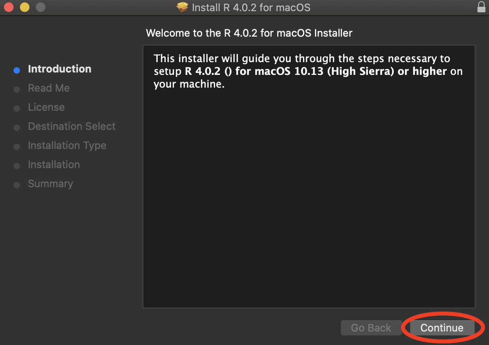
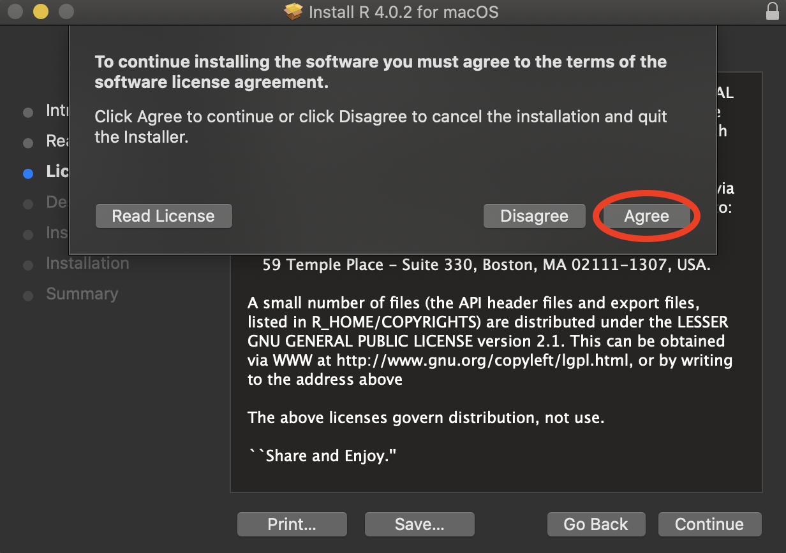
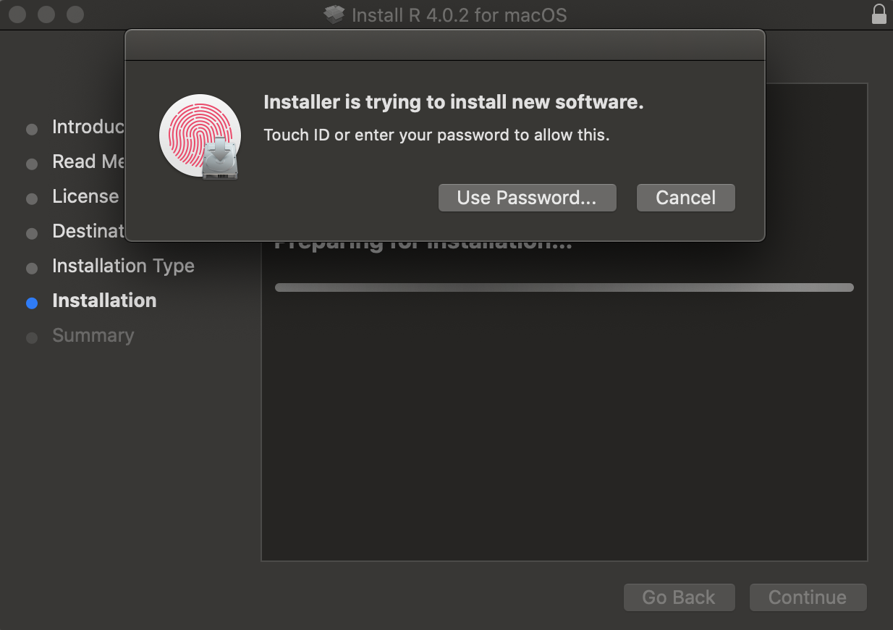
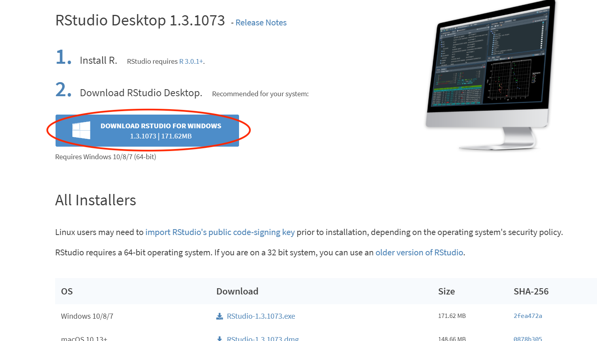
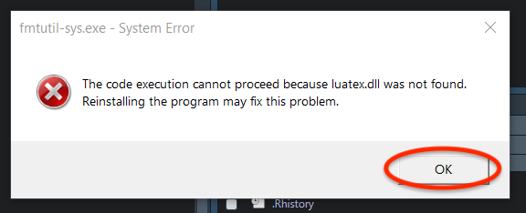

```{r setup, include=FALSE}
knitr::opts_chunk$set(echo = TRUE)
```

This is a guide to installing R and RStudio locally, on your own machine. Instructions for both Mac and Windows machines are included, as well as plenty of screenshots to make the process easy to follow. Instructions for Linux distros are not provided, but presumably if you use Linux you're knowledgeable enough about computers to be able to figure out stuff on your own.

# macOS

## Installing R

If you already have R installed, skip this section and go straight to installing RStudio. To check whether you have R, open the Terminal and type:

```{bash, eval=FALSE}
R --version
```

If you get a ``command not found`` error, that means you don't have R installed and you can proceed with the steps below. If R is already on your machine, it's good to make sure you have the latest version installed - if your version is lower than 3.6.1, it might be a good idea to do a fresh reinstall of R.


Let's download R. Go to https://cloud.r-project.org/ and click on *Download R for (Mac) OS X*.


Click on the .pkg download of the latest R release (as of November 2019, that is 3.6.1, nicknamed "Action of the Toes" as a reference to [this Peanuts comic](https://www.gocomics.com/peanuts/1971/03/22)).

Now let's start the installation. Double click on the downloaded .pkg file in your browser's Download pane to start the installer.


If you've ever installed anything on your Mac, you should be pretty comfortable with this process.

Click *Continue*.



Click *Continue* again...


... and again one more time.


Agree to the terms of service - if you disagree, you cannot install R.



Finally, click *Install*. The installation is not big (just over 160Mb), but make sure you have sufficient disk space nonetheless.


Make sure to give permission for the installation. Note that you cannot do this unless you have administrator rights on your machine (which you should have if you're using your own laptop).



Let the installation run its course. This should be pretty quick - less than a minute.


Close the installer. 


To check that everything went well, reopen the terminal and type in the same command as before:

```{bash, eval=FALSE}
R --version
```

This time, the ``command not found`` error should be replaced by information on the R version you're running on your machine.

## Installing RStudio

Now let's install RStudio - the most popular IDE (Integrated Development Environment) for the R language. If you already have RStudio installed, you can skip this section.

Go to https://rstudio.com/products/rstudio/download/, and scroll down until you see the download options. We will be downloading RStudio Desktop (Open Source License), since it is free - click the big blue *Download* button.


This takes us to a list of downloads for different platforms - choose the one that says *RStudio 1.2.5019 - macOS 10.12+ (64-bit)*. This will download a .dmg file onto your machine. 


Double click on the .dmg file in the downloads pane, or wherever you downloaded it to, to start the installer. Again, if you've installed programs on your Mac before, this should be familiar territory. The installer will do its thing.


A window like the one below will appear once everything is done. Click and drag the *RStudio.app* icon into the Applications folder.


Don't forget to eject the installer at the very end - right click onto the disk icon that appeared on your Desktop during installation, and select *Eject "RStudio-1.2.5019"*.


# Windows

## Installing R

If you already have R installed, skip this section and go straight to installing RStudio. To check whether you have R, click on the *Start* menu at the bottom left of your desktop, and check whether R appears in the list of all programs. If it does, it means that R is already installed on your computer - clicking on it once will reveal which version it is. It's good to make sure you have the latest version installed - if your version is lower than 3.6.1, it might be a good idea to do a fresh reinstall of R.

Let's download R. Go to https://cloud.r-project.org/ and click on *Download R for Windows*.


Now under *Subdirectories*, click the *base* link.


Click the link that says *Download R 3.6.1 for Windows* to download a .exe file.


Now let's start the installation. Double click on the downloaded .exe file in your browser's Download pane, or wherever you saved it to, to open the setup wizard. When asked whether you allow this app to make changes to your device, click *Yes*. Note that you cannot do this unless you have administrator rights on your machine (which you should have if you're using your own laptop).

<!--  -->

You can use any language you want during installation, but this guide will be using English, so if you want to follow along it's best that you use English too.


Click *Next*.


You will be prompted to choose a location for your installation - the setup wizard usually picks a good place by default (usually in your *Program Files* directory), so you needn't modify anything here unless you specifically want your R installation in a different place. Click *Next*.


You will now be prompted for which components you'd like to install - make sure all are selected (unless you specifically desire not to install certain components), and click *Next*.


Accept defaults for startup options, unless you know what you're doing. Click *Next*.


The setup wizard will create a shortcut in your Start Menu. You can leave everything as it is, and click *Next*.


If you want to create a Desktop shortcut, or a Quick Launch shortcut, make sure to select the appropriate checkboxes. Leave the bottom two checkboxes (under "Registry entries") selected. Click *Next*.


The setup wizard will now proceed to install everything appropriately. This should be fairly quick - less than a minute.


Once the installation is complete, click *Finish* to quit the setup wizard.


R should now be installed on your machine! Just to double check, click on the *Start* menu at the bottom left of your desktop, and make sure that R appears in the list of all programs.

## Installing RStudio

Now let's install RStudio - the most popular IDE (Integrated Development Environment) for the R language. If you already have RStudio installed, you can skip this section.

Go to https://rstudio.com/products/rstudio/download/, and scroll down until you see the download options. We will be downloading RStudio Desktop (Open Source License), since it is free - click the big blue *Download* button.



This takes us to a list of downloads for different platforms - choose the one that says *RStudio 1.2.5019 - Windows 10/8/7 (64-bit)*. This will download a .exe file onto your machine. 


Double click on the .exe file in the downloads pane, or wherever you downloaded it to, to start the installer. Click *Next*.


You will be prompted to choose a location for your installation - the setup wizard usually picks a good place by default (usually in your *Program Files* directory), so you needn't modify anything here unless you specifically want your RStudio installation in a different place. Also, make sure you have enough disk space available - RStudio requires a significant 777 Mb. Click *Next*.


The setup wizard will create a shortcut in your Start Menu. You can leave everything as it is, and click *Next*.


The setup wizard will now do its thing. This shouldn't take too long.


Once the installation is complete, click *Finish* to quit the setup wizard.


# Installing LaTeX

LaTeX is a system for typing up high-quality documents. We need LaTeX in R in order to be able to knit R Markdown documents to pdf. If we try to knit a .Rmd file to .pdf before installing LaTeX, we get the following error:


While LaTeX installations are platform-dependent, installing it for the sole purpose of use in R Markdown can be done very easily in a platform-independent way from within RStudio. Just open up RStudio, and type the following code into the console:

```{r, eval=FALSE}
tinytex::install_tinytex()
```

The installer will start. You will see something like this (note that this screenshot is taken from a Windows computer, it might look a tad different on a Mac):


For Windows PCs only, you might see the following dialog box pop up. Just click *Ok*.


As the dialog box mentioned, you'll see two more error dialog boxes. Don't worry about them - just ignore whatever they say and click *Ok* for both.




Once everything is done, you should see the prompt (i.e. the funny ``>`` symbol in the console after which you type commands), as well as the following message:


Now quit RStudio by pressing ``Cmd + Q`` on a Mac or ``Alt + F4`` on Windows, and then reopen it. To check whether your installation was successful, now type into the console:

```{r, eval=FALSE}
tinytex:::is_tinytex()
```

You should see the output ``[1] TRUE``.

# Setting Up Your Workspace

## Folder Hierarchy

## Packages

## Transferring Files from the RStudio Server

# Optional

## Customizing RStudio

## Using GitHub with RStudio
