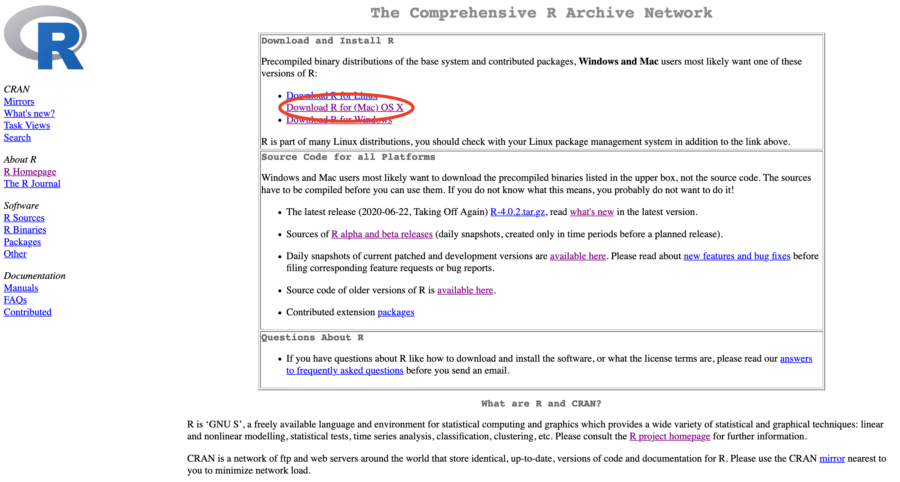
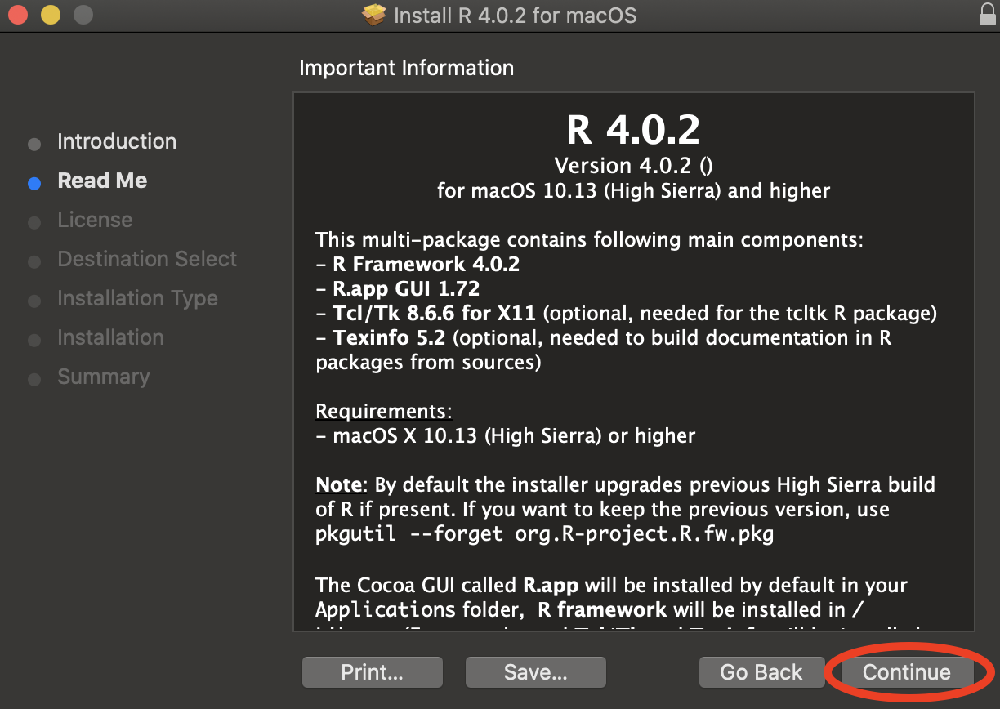

```{r setup, include=FALSE}
knitr::opts_chunk$set(echo = TRUE)
```

This is a guide to installing R and RStudio locally, on your own machine. Instructions for both Mac and Windows machines are included, as well as plenty of screenshots to make the process easy to follow.

# macOS

## Installing R

If you already have R installed, skip this section and go straight to installing RStudio. To check whether you have R, open the Terminal and type:

```{bash, eval=FALSE}
R --version
```

If you get a ``command not found`` error, that means you don't have R installed and you can proceed with the steps below. If R is already on your machine, it's good to make sure you have the latest version installed - if your version is lower than 3.6.1, it might be a good idea to do a fresh reinstall of R.


Let's download R. Go to https://cloud.r-project.org/ and click on *Download R for (Mac) OS X*.



Click on the .pkg download of the latest R release (as of November 2019, that is 3.6.1, nicknamed "Action of the Toes" as a reference to [this Peanuts comic](https://www.gocomics.com/peanuts/1971/03/22)).

Now let's start the installation. Double click on the downloaded .pkg file in your browser's Download pane to start the installer.


If you've ever installed anything on your Mac, you should be pretty comfortable with this process.

Click *Continue*.


Click *Continue* again.



Keep clicking *Continue*.


Agree to the terms of service - if you disagree, you cannot install R.


Finally, click *Install*. The installation is not big (just over 160Mb), but make sure you have sufficient disk space nonetheless.


Make sure to give permission for the installation. Note that you cannot do this unless you have administrator rights on your machine (which you should have if you're using your own laptop).


Let the installation run its course. This should be pretty quick - less than a minute.


Close the installer. 


To check that everything went well, reopen the terminal and type in the same command as before:

```{bash, eval=FALSE}
R --version
```

This time, the ``command not found`` error should be replaced by information on the R version you're running on your machine.

## Installing RStudio

## Installing LaTeX

# Windows

## Installing R

## Installing RStudio

## Installing LaTeX
